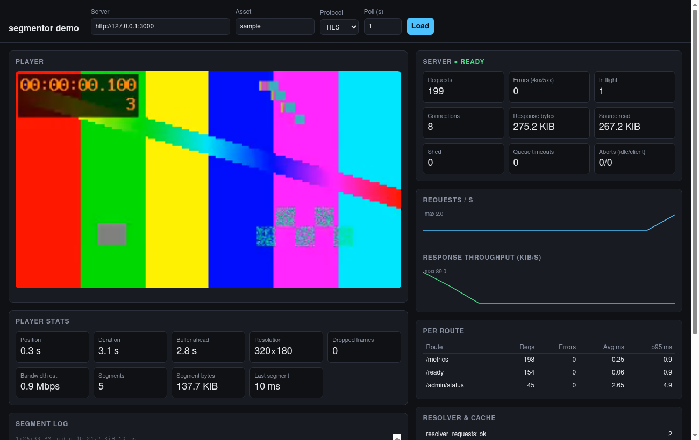
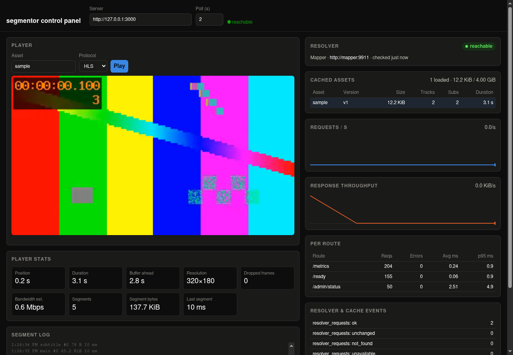

# segmentor

**On-demand HLS and DASH packaging for MP4 files, in Rust.**

[](https://github.com/includeamin/segmentor/actions/workflows/ci.yml)
[](#license)

segmentor is an HTTP origin. Point it at MP4 files, on disk or on an HTTP origin that a small
*mapper* service tells it about, and it serves them as HLS and DASH, packaging each segment when
it is requested. Nothing is pre-generated, transcoded, or stored: the encoded audio and video are
re-wrapped as fragmented MP4 and streamed straight from the source, so the work per request is
proportional to the segment asked for, not to the length of the video.

> **Alpha (0.x).** The code is tested and documented, but it has been checked mostly against
> synthetic files and one browser, APIs and configuration may change between releases, and it has
> not been through a security review. Try it, tell us which files it does not handle, and read
> [what was and was not verified](docs/technical-design/0004-broader-mp4-input-support.md) before
> you depend on it.

## What it does

- **Packages on demand.** Playlists and manifests are built when an asset loads and segments when
  they are requested, from a sample index kept in memory. There is no packaging step and no output
  to store.
- **Reads what encoders produce.** Progressive and fragmented MP4, M4A, and QuickTime files with
  H.264, HEVC, VP9, or AV1 video and AAC, AC-3, E-AC-3, Opus, or FLAC audio. See
  [supported input](docs/supported-input.md).
- **Finds media through a mapper.** A mapper service answers "where is asset X?" with a file or an
  HTTP location, so the catalog lives wherever you already keep it. Remote origins are read with
  ranged requests and the server never downloads a whole file.
- **Is bounded by construction.** Every length read from a file or a mapper is checked before it is
  allocated, and the limits are configuration. `unsafe` code is forbidden. The parser is run against
  corrupted input on every test run, and has a fuzz target.
- **Is built to be operated.** Prometheus metrics, health endpoints, load shedding, graceful
  shutdown, and immutable content-versioned URLs for CDNs.

## What it does not do

- **No transcoding.** The codecs must already suit the protocol, and there is no bitrate ladder
  unless you supply the renditions. Adaptive renditions are
  [planned](docs/technical-design/0006-trick-play-subtitles-and-renditions.md).
- **No DRM, no live streaming, no MPEG-TS output.** Segments are fragmented MP4. DRM is planned
  after the features above.
- **No TLS or authentication.** Run it behind a reverse proxy or CDN that provides both; see
  [operations](docs/operations.md).

## How it fits with other tools

| If you want to... | Consider |
| --- | --- |
| Convert files to HLS/DASH once and host static files | FFmpeg, [Shaka Packager](https://github.com/shaka-project/shaka-packager), or Bento4 |
| Serve HLS/DASH without storing packaged output, as a standalone service, with strict resource limits | **segmentor** |
| DRM, live streaming, or MPEG-TS output today | Shaka Packager |
| A mature on-demand packager that runs inside nginx | Kaltura's [nginx-vod-module](https://github.com/kaltura/nginx-vod-module) (AGPL-3.0) |

segmentor takes its idea, packaging on demand instead of ahead of time, from nginx-vod-module but
contains none of its code; see [the research notes](docs/research/nginx-vod-module.md). Check each
project's own documentation for what it supports today; this table is a rough guide.

## Quick start

```sh
git clone https://github.com/includeamin/segmentor
cd segmentor
make serve        # serves tests/fixtures/h264-aac.mp4 as the asset "sample" on :3000
```

Then play it:

```sh
ffplay http://127.0.0.1:3000/hls/sample/master.m3u8
```

`make demo` starts a web player with live server metrics, and `make help` lists everything else; see
[Using segmentor](docs/usage.md).

## Screenshots

|                                                          |                                                                    |
| -------------------------------------------------------- | ------------------------------------------------------------------ |
| [](docs/assets/screenshots/demo.png) | [](docs/assets/screenshots/admin.png) |
| `make demo`: plays an asset and shows live server metrics next to it. | `make admin` (or `docker compose -f docker-compose.dev.yml up`): a control panel showing the resolver's live connection, the loaded-asset cache, and metrics, with the same player. |

## Install

- **Release binaries.** Each [GitHub release](https://github.com/includeamin/segmentor/releases)
  attaches Linux binaries for x86-64 and arm64 with checksums and build attestations.
  [`install.sh`](install.sh) downloads one, verifies its checksum, and copies it into place
 ).
- **Container image.** `ghcr.io/includeamin/segmentor`, for the same architectures:

  ```sh
  docker run --rm -p 3000:3000 --read-only --cap-drop=ALL \
    -v "$PWD/vod.toml:/etc/vod/vod.toml:ro" -v "$PWD/media:/srv/vod:ro" \
    ghcr.io/includeamin/segmentor:latest
  ```

- **From source.** `cargo install --git https://github.com/includeamin/segmentor`, which needs a
  recent stable Rust toolchain and a C compiler.

See [Deploying](docs/deployment.md) for Compose, Kubernetes and systemd files, and
[Verifying a release](docs/releasing.md#verifying-a-release) for checking downloads.

## Documentation

The handbook, built with mdBook, covers everything beyond this page:

- [Using segmentor](docs/usage.md): endpoints, the web player demo, the packaging command
- [Supported input](docs/supported-input.md), [Deploying](docs/deployment.md), and
  [Operating the origin](docs/operations.md)
- [Mapper API](docs/mapper-api.md), [architecture](docs/architecture.md), and the
  [technical designs](docs/technical-design/README.md)
- [Releasing](docs/releasing.md), including how versions and tags are made

Build it locally with `make book-serve` (see [docs/README.md](docs/README.md)).

## Contributing and security

Contributions are welcome; start with [CONTRIBUTING.md](CONTRIBUTING.md), which covers building,
testing, and the sign-off every commit needs. Files that will not load or play are the most useful
reports there are: there is an issue form for them. Report security problems privately, as
described in [SECURITY.md](SECURITY.md). Everyone taking part is expected to follow the
[Code of Conduct](CODE_OF_CONDUCT.md).

## License

Licensed under either of

- [Apache License, Version 2.0](LICENSE-APACHE)
- [MIT license](LICENSE-MIT)

at your option.

Unless you explicitly state otherwise, any contribution intentionally submitted for inclusion in this project by you, as defined in the Apache-2.0 license, shall be dual licensed as above, without any additional terms or conditions.
