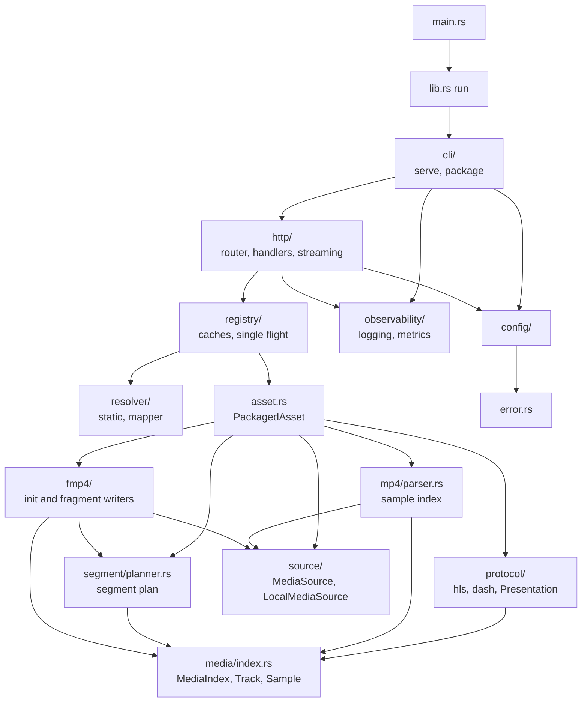

# Implementation guide

This part of the book explains how `segmentor` works inside, module by module, so a new contributor can find the right file, understand its invariants, and change it safely. The [technical designs](../technical-design/README.md) explain *why* the system is shaped this way; this guide explains *how the code does it*.

| Page | Covers |
| --- | --- |
| This page | Big picture, lifecycles, data model, concurrency, conventions |
| [Media pipeline](media-pipeline.md) | `source`, `mp4`, `media`, `segment`, `fmp4`: from bytes on disk to fragments |
| [Registry and resolvers](registry-and-resolvers.md) | `resolver`, `registry`, remote `source`: asset lookup, caching, and loading |
| [Protocols and assets](protocols.md) | `protocol` (`hls`, `dash`, `Presentation`) and `asset`: playlists, manifests, and the loaded-asset object |
| [HTTP server](http-server.md) | `http/`: router, middleware, handlers, streaming, ranges, errors |
| [Runtime support](runtime-support.md) | `config/`, `error`, `observability/` (logging, metrics), `cli/`, `lib`/`main` |
| [Testing](testing.md) | Test layers, fixtures, fuzzing, `make ci` |
| [Code organization](code-organization.md) | Review of the source layout and a proposed reorganization |

## What the program does

`segmentor` is a video-on-demand **origin**. Given an ordinary MP4 file, it answers HLS and DASH requests by *repackaging* the existing encoded audio and video into fragmented MP4 (fMP4) on the fly. It never decodes or re-encodes media. The expensive facts about a file (where every frame is, when it plays, which frames are keyframes) are computed once when the asset is loaded. A segment request then only builds a small header and copies the requested byte ranges from the file.

It has two commands:

- `serve --config <file>` runs the HTTP origin.
- `package --input <mp4> --output <dir>` writes the same init and media segments to disk. It is a development and test tool that shares all packaging code with the server.

## Module map



`protocol` does not depend on `asset`: `asset` builds a read-only `Presentation` (tracks, plan, version) once at load, calls the renderers with it, and stores the rendered text.

The crate is a library plus a ten-line binary. Almost everything is `pub(crate)`; the public surface is `run()` and a hidden `fuzzing` module used by the fuzz target (see [Code organization](code-organization.md)).

## Startup lifecycle

1. `main` calls `lib::run`, which dispatches through `cli::run` and parses `serve --config` by hand.
2. `Config::load` reads and validates the TOML file, resolves the media root and every asset path to canonical absolute paths, and rejects anything outside the root.
3. `observability::logging::init` installs the non-blocking `tracing` subscriber.
4. `http::serve` calls `AppState::new`, which builds the CORS layer, the resolver, the remote-media client, and the asset registry. Nothing is loaded yet.
5. With the static catalog, `preload()` then loads **every** configured asset (bounded by `limits.max_startup_parses`): open the source, `mp4::parse`, `segment::plan`, one `fmp4::write_init_segment` per track, compute the version, and render all playlists from a `Presentation` view. Total index memory is checked against `limits.max_index_bytes`. A bad asset stops startup. With a mapper, assets load on their first request instead.
6. The process binds the listener and logs `service_ready`.

## Request lifecycle

Layers wrap the router. The request passes through them outermost to innermost:

```text
request_id -> TraceLayer -> record_metrics -> CORS -> shed_load -> enforce_header_limit -> TimeoutLayer -> handler
```

A handler then does, in order:

1. Ask the registry for the asset by ID: a cache hit is two short mutex sections; a miss resolves the location, opens the source, and loads it (`404`, `502`, `503`, or `500` on failure).
2. For init and media routes, require `?v=` to equal the asset version (`404` otherwise).
3. Check `If-None-Match` and answer `304` if it matches.
4. Produce the body:
   - **Playlist or manifest:** clone precomputed `Bytes`.
   - **Init segment:** slice the cached init `Bytes`, honoring `Range`.
   - **Media segment:** build the header on the blocking pool, then stream header plus source ranges from an async task.

The request span and metrics record the outcome. See [HTTP server](http-server.md) for the details of each step.

## Core data model

Everything downstream of parsing works on three immutable values, built once per asset.

| Type | Defined in | Meaning |
| --- | --- | --- |
| `MediaIndex` | `media/index.rs` | Source identity, movie timescale and duration, and a `Track` per audio or video track |
| `Track` | `media/index.rs` | Track ID, kind, timescale, codec configuration, and a `Vec<Sample>` |
| `Sample` | `media/index.rs` | One encoded frame or audio packet: byte `offset` and `size` in the source, `decode_time`, `duration`, `composition_offset`, and `is_sync` |
| `SegmentPlan` | `segment/planner.rs` | A list of `Segment`s, each holding one `TrackSegment` per track: a half-open sample range plus decode time and duration |
| `PackagedAsset` | `asset.rs` | Source, index, plan, cached init segments, version, and pre-rendered playlists |

A `Sample` holds *where* the data is, never the data. Nothing in the index contains media payload bytes.

Timestamps are integers in each track's own **timescale** (ticks per second). Conversion between timescales happens only at segment boundaries, with checked integer arithmetic (`segment::planner::rescale`).

## Concurrency model

| Work | Runs on | Bounded by |
| --- | --- | --- |
| HTTP accept, routing, middleware, playlists | Tokio worker threads | `max_concurrent_requests` (soft) |
| Asset metadata fetch (local or remote) | Async tasks | `limits.max_startup_parses` load slots, remote `max_inflight_reads` |
| Asset assembly (planning, init segments, rendering) | Tokio blocking pool | The same load slots |
| Segment header construction | Tokio blocking pool (`spawn_blocking`) | Blocking pool size |
| Source reads for segments | Local: blocking pool, one read per chunk; remote: async ranged HTTP | `limits.max_segment_jobs` slots, held per read |
| Streaming a segment response | One async task per response | Two-item channel, `response_idle_timeout_ms` |
| Log writing | One dedicated thread (`tracing-appender`) | `logging.buffer_capacity`, lossy |
| Dropped-log monitor | One dedicated thread | Wakes every 10 s |

Loaded assets are shared as `Arc<PackagedAsset>` and are immutable, so no request path takes a lock on media data. The only shared mutable state is semaphores, atomics (metrics, readiness), and the log queue.

## Conventions

- **Checked arithmetic on anything derived from a file.** Offsets, sizes, counts, and timestamps come from untrusted input. Use `checked_*`, `try_from`, and explicit limits. Limits are checked *before* allocation or table expansion.
- **Typed errors, generic responses.** Return `Error` variants; `HttpError` decides the status. Error text goes to logs, never to clients (except the short messages for `404`).
- **No payload in the index, no payload in logs.**
- **Comments say why.** Doc comments are used for invariants and non-obvious decisions, not to restate code.
- **Lints.** `unsafe_code` is forbidden, Clippy `all` and `pedantic` warn and CI denies warnings, `missing_docs` warns, and rustfmt uses `max_width = 100`. Run `make ci` before pushing.
- **Keep `config/` lean.** It stores plain strings for CORS and leaves parsing into HTTP types to `http/cors.rs`. This was required while the fuzz target compiled it by path; it is now only a preference.

## Where to start for common changes

| I want to | Start in |
| --- | --- |
| Support another codec | `mp4/parser.rs` (`parse_codec`, `validate_sample_description`), `media/index.rs` (`CodecConfig`), `protocol/hls.rs` and `protocol/dash.rs` (codec strings), `fmp4/init.rs` |
| Change how segments are cut | `segment/planner.rs` |
| Change fragment layout | `fmp4/fragment.rs` (`build_moof`, `prepare_media_segment`) |
| Add or change an HTTP route | `http/router.rs` (add a constant and list it in `ROUTES`, which also labels metrics) and a file in `http/handlers/` |
| Add a config option | `config/mod.rs` (raw struct, validation, `Config`) or the matching file in `config/`, `vod.example.toml`, and the docs |
| Add a limit | `LimitsConfig` in `config/limits.rs`, its validation and default, then enforce it where the resource is allocated |
| Add a metric | `observability/metrics.rs` (field, recorder, `render`) |
| Add a source of media bytes | `source/` (see the [mapper design](../technical-design/0002-asset-map-interface.md)) |
