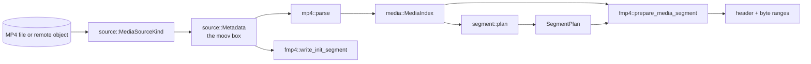

# Media pipeline

These modules turn an MP4 file into segment data. They contain no HTTP and no protocol text, and they can be tested with nothing but a fixture file.

## How an MP4 is organised (just enough to read the code)

An MP4 is a sequence of **boxes**, each with a 4-byte size and a 4-byte type name. Two matter here:

- `mdat` holds the encoded frames back to back.
- `moov` holds metadata: for each track (`trak`), a **sample table** (`stbl`) describing every frame.

The sample table is stored compactly, as separate run-length or chunked tables that the parser expands:

| Box | Tells us | Expanded into |
| --- | --- | --- |
| `stsz` | Size of each sample (or one constant size) | `Sample.size` |
| `stsc` + `stco`/`co64` | Which samples are in which chunk, and where each chunk starts | `Sample.offset` |
| `stts` | Decode-time deltas, run-length encoded | `Sample.decode_time`, `Sample.duration` |
| `ctts` | Composition (display) offsets for B-frames | `Sample.composition_offset` |
| `stss` | Which video samples are keyframes | `Sample.is_sync` (absent means every sample is sync) |
| `stsd` | Codec configuration (H.264 SPS/PPS, AAC parameters) | `Track.codec` |

`moov` may come before or after `mdat`; both layouts are supported (`h264-aac-moov-last.mp4` is a fixture).

## `source/` : reading bytes

`source/mod.rs` defines what the rest of the pipeline reads through.

- `ByteRange { offset, length }` with a checked `end()`.
- `SourceIdentity`: an `Origin`, the length, and an optional `moov_sha256`. `Origin::Local` records canonical path, device, inode, and modification time; `Origin::Remote` records the URL without its query string and the validator reads are conditioned on. It identifies exactly which bytes were parsed.
- `MediaSourceKind`: `Local` or `Http`, with async `read_range` and `verify_unchanged`.

`local.rs` (`LocalMediaSource`) is the Linux file source.

- **`open`** canonicalizes the path, opens the file, and records device, inode, length, and mtime.
- **`read_range`** checks that `offset + length` does not overflow and stays within the file, *then* allocates and fills the buffer with `read_exact_at`. Positioned reads (`pread`) share no cursor, so concurrent requests can read one `File` without locking. It is synchronous; `MediaSourceKind::read_range` runs it on the blocking pool, one chunk per call.
- **`verify_unchanged`** re-reads metadata and fails if device, inode, length, or mtime changed since `open`.

`http.rs` is the remote source and `sparse.rs` the metadata reader; both are described in [Registry and resolvers](registry-and-resolvers.md#source-reading-the-media).

**Contributing:** keep reads bounds-checked before allocating, and never share a seek cursor on the request path.

## `media/` : the immutable index

`media/index.rs` contains only data types (`MediaIndex`, `Track`, `TrackKind`, `CodecConfig`, `Sample`). `CodecConfig::Avc` carries width, height, the profile, compatibility and level bytes, and the first SPS and PPS. `CodecConfig::Aac` carries sample rate and channel count. `Sample` is `Copy` and about 40 bytes with padding, which is what `PackagedAsset::index_bytes` uses to estimate memory.

## `mp4/parser.rs` : bytes to `MediaIndex`

Entry point: `async parse(&MediaSourceKind, limits) -> ParsedMedia { index, metadata }`, where `metadata` is the `Metadata` the index was built from (the init segment writer reuses it, so the file is not read again). The parser is in-tree, built on a bounded box walker (`mp4/boxes.rs`) whose every length is checked against the bytes present. It is deliberately defensive, in this order:

1. **Size limit.** Reject sources larger than `limits.max_source_bytes`.
2. **`Metadata::fetch`** (async). Walk top-level boxes through an 8 KiB read window, so consecutive small reads near each other cost one request (an HD fragment's whole `moof` and the header of its `mdat` usually fit). Keep `moov` whole, and keep every `moof` whole with its offset. Reject impossible sizes, a missing `moov`, more than 4,096 other top-level boxes, more than `limits.max_fragments` fragments or `mdat` boxes, and `moov` plus `moof` bytes beyond `limits.max_metadata_bytes`. Nothing in `mdat` is ever read, whether the source is local or remote. Because every top-level box header is visited, a truncated `mdat` is rejected here, before any table is expanded.

The remaining steps are synchronous CPU work in `parse_metadata`, run on the blocking pool:

3. **`validate_raw_moov`.** Walks `moov` once and decides, per track, whether it is packaged:
   - `mvex` in `moov` means fragmented input: its `trex` defaults are read, and the samples come from the `moof` boxes instead of from `moov`;
   - tracks whose handler is neither `vide` nor `soun` (timecode, timed metadata, subtitles) are skipped, and their tables are never read;
   - `dinf/dref` must contain exactly one self-contained `url ` entry (no external data references);
   - `stsd` must contain exactly one entry, and it must be `avc1` or `mp4a`; `encv`/`enca` (encrypted) are rejected, an unknown video entry with at most one sample is skipped as a still image, and anything else is rejected naming the entry.
4. **Hash `moov`** with SHA-256.
5. **`parse_track`** per packaged track: `mdhd` (timescale, duration, language), then the codec configuration from the sample entry (`mp4/codec.rs`). Only what the manifest needs is read: `avcC`, `hvcC`, `vpcC`, or `av1C` for the codec string and dimensions; `esds` for AAC, whose audio object type must be LC, SBR, or SBR with parametric stereo (QuickTime's versioned entries with a `wave` box included); `dac3`, `dec3`, `dOps`, or `dfLa` for AC-3, E-AC-3, Opus, and FLAC. Then the sample tables.
6. **Sample tables** (`mp4/tables.rs`). `stts`, `ctts` (signed in version 1), `stss`, `stsc`, `stsz` or the compact `stz2`, and `stco` or `co64` are parsed with every entry count checked against its box before allocating. `expand_samples` then checks the sample count against `limits.max_samples_per_track` and expands the tables through `sample_sizes`, `sample_offsets`, `sample_times`, and `composition_offsets`. `sample_times` and `composition_offsets` bound each run-length entry against the sample count *before* expanding it, so a crafted `stts` claiming billions of samples fails immediately. Every sample's byte range must end inside the source.
   **Fragmented files** (`mp4/fragments.rs`) take their samples from the `moof` boxes instead. Each `traf`'s `tfhd` gives the track, the base offset (explicit, relative to the `moof`, or, in the legacy layout, where the previous `traf`'s data ended), and defaults; `tfdt` gives the fragment's decode time, continuing from the previous fragment when absent; each `trun` lists samples whose fields fall back to the `tfhd` and then the `trex` defaults. A `trun` cannot claim more entries than its bytes hold, a run belonging to another track is measured by arithmetic and never iterated, and a fragment that starts before the previous one ended is rejected because the planner needs samples in decode order. A track's samples in `moov` as well as in fragments are refused.
7. **Edit lists** (`mp4/edit.rs`). Each track's edit list is read: one edit, optionally after one empty edit, is applied by shifting every track forward by one shared offset so no decode time goes negative (see [TDD 0004](../technical-design/0004-broader-mp4-input-support.md)); other shapes are rejected. Skipped tracks are reported in `MediaIndex::skipped_tracks`. For a fragmented file the timeline is then moved to start at zero, by the earliest first decode time across tracks found in seconds, and each track's duration is taken from its last sample, because the durations in `mvhd`, `mdhd`, and `tkhd` are usually zero. Tracks are numbered in file order: one video track, then `audio-1`, `audio-2`, and so on.

Back in async code:

8. **Mutation check.** `verify_unchanged` on the source, then re-read and re-hash `moov`; if either differs, the source changed mid-parse and the result is discarded. For a remote object `verify_unchanged` re-probes length and validator.

The result carries the `moov` hash in its `SourceIdentity`. `PackagedAsset::version` is derived from it.

**Contributing:** the tests in the module compare every sample against `tests/fixtures/h264-aac.ffprobe.json`, an FFprobe dump committed as ground truth. When adding a rejection rule, mutate the fixture's `moov` bytes in a test (see `find_type` and `fixture_moov` in the tests, which run the async fetch on a private runtime) instead of committing another binary.

## `segment/planner.rs` : where to cut

`plan(index, target_duration_ms, limits) -> SegmentPlan`.

Rules: at most one video track, at least one track of some kind, and the first sample of the reference track must be a sync sample. The reference track is the video track, or with no video the first audio track.

- **Reference boundaries** (`reference_boundaries`): start at sample 0. From each boundary, the next boundary is the first *sync* sample whose decode time is at least `boundary_time + target`. The target duration is a goal, not a guarantee; segments are exactly as long as keyframe spacing allows, and the last one takes whatever remains.
- **Audio follows the reference** (`audio_segment`): convert the reference segment's start and end times to the audio timescale (`rescale`) and take every audio sample whose decode time falls in that window using binary search (`partition_point`). The final segment takes all remaining audio.
- **Durations are real.** A segment's duration is computed from actual sample decode times, so playlists report true values.
- Each segment is checked against `limits.max_samples_per_segment`.

Output: `Segment { index, tracks: Vec<TrackSegment> }`, where a `TrackSegment` is `first_sample..end_sample` plus `decode_time` and `duration` in that track's timescale.

**Contributing:** all timescale conversions must use `rescale` (checked). Any change here changes segment URLs' contents, so run the FFmpeg decode tests.

## `fmp4/` : building fragments

Two independent writers, both producing ISO BMFF that players can consume.

### `fmp4/init.rs`: initialization segment

`write_init_segment(metadata, track_id)` builds `ftyp + moov` for a single track from the `moov` bytes kept by the parse, at the byte level, without re-serializing through a box model.

- `ftyp` is fixed: major brand `iso6`, compatible `iso6` and `mp41`. The source's brands describe the source file, not this stream.
- The `stsd` box (the sample entry) is copied **byte for byte**. That is what keeps `pasp` (pixel aspect ratio), `colr`, HDR boxes, and the codec configuration exactly as the encoder wrote them, and it is why a new codec needs no per-codec box writer. The one exception is a QuickTime-style `mp4a` entry (sound description version 1, `esds` inside `wave`), which browsers refuse; it is rewritten in the ISO layout with the same channel count, sample rate, and `esds`.
- `mvhd`, `tkhd`, and `mdhd` are copied with their durations zeroed; `hdlr`, `vmhd`/`smhd`, and `dinf` are copied as they were.
- The sample tables (`stts`, `stsc`, `stsz`, `stco`) are written empty, and a hand-built `mvex/trex` tells players the file is fragmented.
- Everything else is left out: the edit list (already applied to the sample timestamps, so a player must not apply it again), `udta`, and other tracks.

Each track gets its own init segment ("separate tracks"; see [ADR 0001](../adr/0001-use-fragmented-mp4-for-media-segments.md)). Init segments are built once at asset load and cached.

### `fmp4/fragment.rs`: media segment

`prepare_media_segment(track, track_segment, sequence_number, limits) -> PreparedSegment` does **not** copy payload. It returns:

- `header`: a `moof` box followed by an 8-byte `mdat` header,
- `ranges`: the source byte ranges to append (adjacent samples are merged by `coalesced_ranges`, so a segment is usually a handful of large reads),
- `content_length`: header length plus payload length.

The `moof` is built by `build_moof` with `mfhd` (sequence number), `traf`, `tfhd` (default-base-is-moof), `tfdt` (64-bit base decode time), and a `trun` listing every sample's duration, size, flags, and composition offset. The `trun` carries the offset from the start of the `moof` to the first payload byte, which depends on the `moof`'s own size, so the function builds it twice: once with a placeholder to measure, then again with the real offset.

Sample flags mark keyframes (`SYNC_SAMPLE_FLAGS`) versus dependent frames (`NON_SYNC_SAMPLE_FLAGS`); audio samples are always sync. Payload total is checked against `limits.max_segment_bytes`. Boxes larger than 4 GiB are not supported (32-bit sizes).

`write_media_segment` is async and assembles a complete in-memory segment (header plus ranges read through the source). Only the `package` command uses it; the server streams instead.

**Contributing:** never read payload inside `prepare_media_segment`; the HTTP path depends on it being metadata-only so `HEAD` and range requests stay cheap. Changing box layout should be validated by the FFmpeg decode tests and `tests/package.rs` (determinism).
