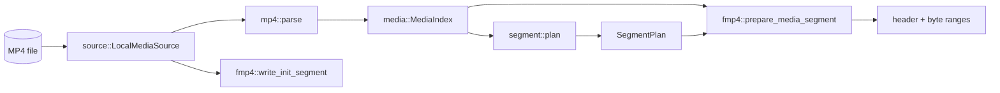

# Media pipeline

These modules turn an MP4 file into segment data. They contain no HTTP and no protocol text, and they can be tested with nothing but a fixture file.

## How an MP4 is organised (just enough to read the code)

An MP4 is a sequence of **boxes**, each with a 4-byte size and a 4-byte type name. Two matter here:

- `mdat` holds the encoded frames back to back.
- `moov` holds metadata: for each track (`trak`), a **sample table** (`stbl`) describing every frame.

The sample table is stored compactly, as separate run-length or chunked tables that the parser expands:

| Box | Tells us | Expanded into |
| --- | --- | --- |
| `stsz` | Size of each sample (or one constant size) | `Sample.size` |
| `stsc` + `stco`/`co64` | Which samples are in which chunk, and where each chunk starts | `Sample.offset` |
| `stts` | Decode-time deltas, run-length encoded | `Sample.decode_time`, `Sample.duration` |
| `ctts` | Composition (display) offsets for B-frames | `Sample.composition_offset` |
| `stss` | Which video samples are keyframes | `Sample.is_sync` (absent means every sample is sync) |
| `stsd` | Codec configuration (H.264 SPS/PPS, AAC parameters) | `Track.codec` |

`moov` may come before or after `mdat`; both layouts are supported (`h264-aac-moov-last.mp4` is a fixture).

## `source/` : reading bytes

`source/mod.rs` defines the abstraction the rest of the pipeline reads through.

- `ByteRange { offset, length }` with a checked `end()`.
- `SourceIdentity`: canonical path, device, inode, length, modification time, and an optional `moov_sha256`. It identifies exactly which bytes were parsed.
- `trait MediaSource { identity(); len(); read_range(range) }`.

`source/local.rs` implements it for a Linux file.

- **`open`** canonicalizes the path, opens the file, and records device, inode, length, and mtime from its metadata.
- **`read_range`** checks that `offset + length` does not overflow and stays within the file, *then* allocates a buffer and fills it with `read_exact_at`. Positioned reads (`pread`) do not touch a shared cursor, so concurrent requests can read the same `File` without locking.
- **`parser_file`** returns a `try_clone` of the handle, seeked to zero, for the `mp4` crate, which needs `Read + Seek`. This is safe because the clone shares an open file description with the original, but all payload reads use positioned I/O and ignore the shared cursor.
- **`verify_unchanged`** re-reads file metadata and fails if device, inode, length, or mtime changed since `open`.

`PackagedAsset` currently holds a concrete `LocalMediaSource`, not the trait. The trait exists so a remote source can be added ([TDD 0002](../technical-design/0002-asset-map-interface.md)).

**Contributing:** keep reads bounds-checked before allocating. Never seek a shared handle on the request path.

## `media/` : the immutable index

`media/index.rs` contains only data types (`MediaIndex`, `Track`, `TrackKind`, `CodecConfig`, `Sample`). `CodecConfig::Avc` carries width, height, the profile, compatibility and level bytes, and the first SPS and PPS. `CodecConfig::Aac` carries sample rate and channel count. `Sample` is `Copy` and about 40 bytes with padding, which is what `PackagedAsset::index_bytes` uses to estimate memory.

## `mp4/parser.rs` : bytes to `MediaIndex`

Entry point: `parse(source, limits) -> MediaIndex`. It is deliberately defensive, in this order:

1. **Size limit.** Reject sources larger than `limits.max_source_bytes`.
2. **`find_moov`.** Walk top-level boxes with tiny `read_range` calls (8-byte headers, plus 8 more for 64-bit sizes, and size `0` meaning "to end of file"). Reject impossible sizes, and reject a `moov` larger than `limits.max_metadata_bytes`. Nothing in `mdat` is ever read.
3. **Read `moov` and `validate_raw_moov`.** A small hand-written box walker, independent of the `mp4` crate, checks each track before the crate sees it:
   - `dinf/dref` must contain exactly one self-contained `url ` entry (no external data references);
   - `stsd` must contain exactly one entry, and it must be `avc1` or `mp4a`; `encv`/`enca` (encrypted) are rejected.
4. **Hash `moov`** with SHA-256.
5. **Parse with the `mp4` crate** (`Mp4Reader::read_header`) over `parser_file`. Reject fragmented input, too many tracks, and any edit list (`elst`), because edit lists change presentation timing and are not implemented.
6. **`parse_track`** per track: kind (subtitle tracks are rejected), `parse_codec` (H.264 needs `avc1` with SPS and PPS; AAC must be AAC-LC), and `parse_samples`.
7. **`parse_samples`** checks the sample count against `limits.max_samples_per_track`, then expands the tables through `sample_sizes`, `sample_offsets`, `sample_times`, and `composition_offsets`. `sample_times` and `composition_offsets` bound each run-length entry against the sample count *before* expanding it, so a crafted `stts` claiming billions of samples fails immediately. Every sample's byte range must end inside the source.
8. **Mutation check.** After parsing, call `verify_unchanged` and re-hash `moov`; if either differs, the source changed mid-parse and the result is discarded.

The result carries the `moov` hash in its `SourceIdentity`. `PackagedAsset::version` is derived from it.

**Contributing:** the tests in the module compare every sample against `tests/fixtures/h264-aac.ffprobe.json`, an FFprobe dump committed as ground truth. When adding a rejection rule, mutate the fixture's `moov` bytes in a test (see `find_type` and `fixture_moov` in the tests) instead of committing another binary.

## `segment/planner.rs` : where to cut

`plan(index, target_duration_ms, limits) -> SegmentPlan`.

Rules: exactly one video track and at most one audio track, and the first video sample must be a keyframe.

- **Video boundaries** (`video_boundaries`): start at sample 0. From each boundary, the next boundary is the first *sync* sample whose decode time is at least `boundary_time + target`. The target duration is a goal, not a guarantee; segments are exactly as long as keyframe spacing allows, and the last one takes whatever remains.
- **Audio follows video** (`audio_segment`): convert the video segment's start and end times to the audio timescale (`rescale`) and take every audio sample whose decode time falls in that window using binary search (`partition_point`). The final segment takes all remaining audio.
- **Durations are real.** A segment's duration is computed from actual sample decode times, so playlists report true values.
- Each segment is checked against `limits.max_samples_per_segment`.

Output: `Segment { index, tracks: Vec<TrackSegment> }`, where a `TrackSegment` is `first_sample..end_sample` plus `decode_time` and `duration` in that track's timescale.

**Contributing:** all timescale conversions must use `rescale` (checked). Any change here changes segment URLs' contents, so run the FFmpeg decode tests.

## `fmp4/` : building fragments

Two independent writers, both producing ISO BMFF that players can consume.

### `fmp4/init.rs`: initialization segment

`write_init_segment(source, track_id)` builds `ftyp + moov` for a single track. It re-reads the header through the `mp4` crate, clones the parsed `moov`, keeps only the requested track, zeroes durations, clears every sample table (`stts`, `ctts`, `stss`, `stsc`, `stsz`, `stco`, `co64`), drops `mvex` and `udta`, and writes it back. It then patches the `moov` size and appends a hand-built `mvex/trex` box, which tells players the file is fragmented. Each track gets its own init segment ("separate tracks"; see [ADR 0001](../adr/0001-use-fragmented-mp4-for-media-segments.md)). Init segments are built once at asset load and cached.

### `fmp4/fragment.rs`: media segment

`prepare_media_segment(track, track_segment, sequence_number, limits) -> PreparedSegment` does **not** copy payload. It returns:

- `header`: a `moof` box followed by an 8-byte `mdat` header,
- `ranges`: the source byte ranges to append (adjacent samples are merged by `coalesced_ranges`, so a segment is usually a handful of large reads),
- `content_length`: header length plus payload length.

The `moof` is built by `build_moof` with `mfhd` (sequence number), `traf`, `tfhd` (default-base-is-moof), `tfdt` (64-bit base decode time), and a `trun` listing every sample's duration, size, flags, and composition offset. The `trun` carries the offset from the start of the `moof` to the first payload byte, which depends on the `moof`'s own size, so the function builds it twice: once with a placeholder to measure, then again with the real offset.

Sample flags mark keyframes (`SYNC_SAMPLE_FLAGS`) versus dependent frames (`NON_SYNC_SAMPLE_FLAGS`); audio samples are always sync. Payload total is checked against `limits.max_segment_bytes`. Boxes larger than 4 GiB are not supported (32-bit sizes).

`write_media_segment` assembles a complete in-memory segment (header plus ranges). Only the `package` command and tests use it; the server streams instead.

**Contributing:** never read payload inside `prepare_media_segment`; the HTTP path depends on it being metadata-only so `HEAD` and range requests stay cheap. Changing box layout should be validated by the FFmpeg decode tests and `tests/package.rs` (determinism).
