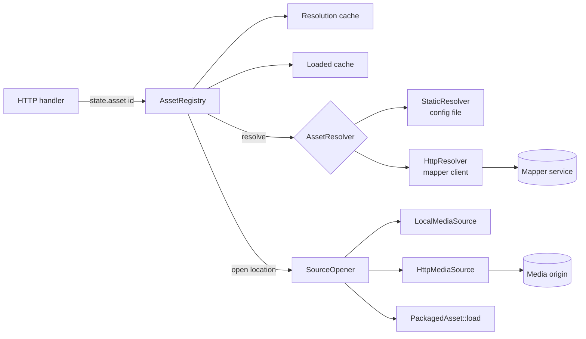

# Registry and resolvers

How an asset ID becomes a loaded, servable `PackagedAsset`. Three modules cooperate: `resolver` says where the media is, `source` reads it, and `registry` caches the answers and schedules the work. The design is in [TDD 0002](../technical-design/0002-asset-map-interface.md); the wire contract mapper authors implement is in the [Mapper API reference](../mapper-api.md).

## `resolver/` : where is the media?

`resolver/mod.rs` defines the vocabulary.

| Type | Meaning |
| --- | --- |
| `AssetLocation` | `File(PathBuf)` (beneath `storage.media_root`) or `Http(Url)` |
| `ResolvedAsset` | Location, a required `version`, `valid_until` (when to revalidate), and optional `hard_expiry` (when the location itself dies) |
| `Resolution` | `Resolved(ResolvedAsset)` or `Unchanged { valid_until }` (a mapper `304`) |
| `ResolveError` | `NotFound`, `Unavailable` (retry later), `Rejected` (the answer is invalid or forbidden) |
| `AssetResolver` | An enum, `Static` or `Http`, with an async `resolve(id, known_version)`. An enum rather than a trait object because native async traits are not dyn-compatible and this avoids a dependency |

**`catalog.rs`** answers from the `[assets.*]` tables. Every answer has the constant version `"static"` and effectively never expires. It also lists its IDs so the registry can preload them.

**`mapper.rs`** is the mapper client. For each lookup it sends `GET {base_url}/v1/assets/{id}` with `Accept`, an optional bearer token, `X-Request-Id`, and `If-None-Match` when it holds a usable answer. It maps statuses to errors, retries `Unavailable` failures with a short backoff (honoring a capped `Retry-After`), reads the body with a hard size cap, then **validates everything** in `interpret`: the echoed ID, the version's shape, the location (relative-path rules, or URL policy), the TTL (explicit, else `Cache-Control`, else default, clamped), and `expires_at`. Unknown JSON fields are ignored; an unknown location `type` fails deserialization and is rejected. Secrets stay in `Secret`, whose `Debug` output is redacted.

**`policy.rs`** holds `LocationPolicy` (scheme, credentials, host allow-list, literal-IP check) and `validate_relative_path`. Both are pure and heavily unit-tested because they are the trust boundary.

## `source/` : reading the media

`MediaSourceKind` is `Local(Arc<LocalMediaSource>)` or `Http(Arc<HttpMediaSource>)`, with async `read_range` and `verify_unchanged`. Local reads run on the blocking pool, one chunk at a time; remote reads are ranged HTTP requests.

**`http.rs`** contains `RemoteReader` (one pooled `reqwest` client shared by all remote sources, an in-flight semaphore, retry settings) and `HttpMediaSource`.

- **Open** sends `Range: bytes=0-0` and requires `206`, a `Content-Range` giving the total length, and a validator: a strong `ETag`, else `Last-Modified`. A `200` (no range support), no validator, or only a weak `ETag` is refused.
- **Read** sends the range with `If-Range: <validator>`. It requires `206`, an exact matching `Content-Range` and total length, and, for an `ETag`, the same tag on the response. A `200` or `412` means the object changed and fails the read as invalid media instead of returning mixed bytes. Transient failures (timeouts, connection errors, `5xx`, `429`) are retried up to `max_retries` and surface as `UpstreamUnavailable`; everything else is `Upstream`.
- **Bounded body.** The response body is accumulated only up to the requested length; more is an error.
- **Address filtering.** The client resolves names through `FilteringResolver`, which drops loopback, private, link-local, shared, multicast, unspecified, and unique-local addresses (including IPv4-mapped forms) unless `allow_private_addresses` is set. Filtering at connect time defeats DNS rebinding. Literal IPs skip resolution, so `LocationPolicy` checks them separately. Redirects are disabled.
- **Verify** re-probes the object and compares length and validator.

**`sparse.rs`** is what makes metadata parsing independent of where a file lives. `SparseFile::fetch` walks the top-level box headers with small reads, fetches `ftyp` and `moov` whole, and records only those regions. `SparseReader` presents them as `Read + Seek` over a file of the true length whose other bytes fail to read, which is exactly what the `mp4` crate needs (it seeks past `mdat`). A remote parse therefore costs a few small range requests, not a download. It caps the top-level box count so a hostile file cannot cause millions of round trips.

`mp4::parse` (in [Media pipeline](media-pipeline.md)) runs `fetch`, parses on the blocking pool, then re-verifies the source and re-hashes `moov` to detect a change during parsing.

## `registry/` : caches and scheduling

`AssetRegistry::get(asset_id)` is the only call the HTTP layer makes per request.

### Fast path

1. Reject syntactically invalid IDs (they never reach a resolver).
2. `lookup` takes two short `std::sync::Mutex` sections and no I/O: a cached recent failure, a negative entry, or a fresh resolution whose asset is in the loaded cache returns immediately.

### Slow path (single flight)

3. `enter_flight` takes a per-asset `tokio` mutex, creating it on demand. A request that finds it busy is a *coalesced waiter* (counted in metrics). The `Flight` guard removes the map entry on drop when nobody else holds it, so the map cannot grow without bound.
4. After the lock the request looks up again; another request may have finished the work.
5. Otherwise it spawns a task that owns the guard and runs `resolve_and_load`. The work therefore continues if the requesting client disconnects, and the waiters get its result from the cache.

`ensure_resolved`:

- A fresh resolution is used as is. A stale one is revalidated with its version as `If-None-Match` (only if its location has not hit `hard_expiry`).
- `Resolved` replaces the entry. If the version **or the location** changed, every loaded copy of the asset is dropped first, with no grace period.
- `Unchanged` extends `valid_until`, never beyond `hard_expiry`.
- `NotFound` records a negative entry and evicts loaded copies.
- `Unavailable` serves the previous answer if it is still inside `stale_if_error` and its location is not hard-expired, and sets a short backoff so the mapper is not asked again for every request. Otherwise the failure is cached for `error_ttl` and returned as `503`.
- `Rejected` becomes `BadUpstream` (`502`) and is cached briefly.

`load` opens the location through `SourceOpener`, acquires a slot from the load semaphore (`max_startup_parses`, waiting at most `load_queue_timeout`, else `503`), runs `PackagedAsset::load`, and inserts the result. A failed load is cached briefly so a broken file is not reparsed on every request. `SourceOpener` confines `file` locations: join to the media root, canonicalize (resolving symlinks), require a regular file, and require the result to still be under the root.

### Caches

- **Resolution cache**: `id -> Slot`, either `Found { resolved, backoff_until }` or `Missing { until }`, bounded by `max_cached_resolutions` (expired entries are swept first).
- **Loaded cache** (`cache.rs`): a byte-weighted LRU keyed by `(asset_id, version)`. Weight is `PackagedAsset::index_bytes`; inserting evicts the least recently used entries above the budget (`limits.max_index_bytes`). An asset heavier than the whole budget is served but not retained. Only one version of an asset is ever resident. Requests already holding an `Arc` are unaffected by eviction.

### Errors

`RegistryError` maps to HTTP in one place (`http/error.rs`): `NotFound` to `404`, `Unavailable` to `503`, `BadUpstream` to `502`, `LoadFailed` (unsupported or invalid media) to `500`.

### Preload

`preload` loads every ID the resolver already knows (the static catalog) concurrently, logs each, and fails startup with `asset \`x\` could not be loaded: ...` if any fails. It also fails if their combined index size exceeds `limits.max_index_bytes`. With a mapper there is nothing to preload.

## Configuration touched

`[resolver]`, `[resolver.http]`, `[registry]`, and `[remote_media]` in `config/resolver.rs`; see `vod.example.toml` and [Operating the origin](../operations.md).

## Contributing

- Keep the resolver and registry free of blocking calls; blocking work goes through `spawn_blocking`.
- Every value that comes from a mapper is untrusted. Add checks to `interpret` or `policy.rs`, with a test in `registry/tests.rs` that feeds the bad answer through the mock mapper and asserts `502`.
- New failure modes need a `RegistryError` mapping and a decision about whether to cache the failure.
- Tests use real in-process servers (`testutil.rs`): `MockMapper` (scriptable status, delay, body, token, health) and `MockOrigin` (range and validator behavior, request and byte counters). Prefer extending them to faking a trait.
