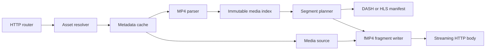

# TDD 0001: On-demand MP4 packaging core

- Status: Accepted
- Created: 2026-09-10
- Updated: 2026-09-10
- Related ADRs: [ADR 0001](../adr/0001-use-fragmented-mp4-for-media-segments.md)

## Implementation status

This design is accepted, but not every capability is implemented. Status terms in this document have precise meanings:

- **Implemented:** present in the current code and covered by automated tests.
- **Pending:** required by this design before the service is production-ready.
- **Deferred:** intentionally outside this design or postponed to a later design.

| Capability | Status | Notes |
| --- | --- | --- |
| Local positioned reads | Implemented | Linux `read_exact_at`; checked source bounds |
| Progressive MP4 sample indexing | Implemented | H.264/AAC sample tables validated against FFprobe |
| Keyframe-aligned segment planning | Implemented | One video track and optional audio track |
| Separate-track fMP4 generation | Implemented | Init segments cached; media segments generated on request |
| HLS VOD | Implemented | Master and media playlists with fMP4 segments |
| TOML asset catalog | Implemented | Loaded and validated at startup |
| Structured non-blocking logs | Implemented | Configurable level/format; bounded lossy queue |
| Direct bounded HTTP range streaming | Implemented | Header plus coalesced source ranges; 256 KiB default chunks |
| Enforceable parser/resource limits | Implemented | Validated TOML limits cover source, metadata, tracks, samples, segments, queues, and headers |
| Source mutation detection | Implemented | Filesystem identity plus pre/post parse `moov` SHA-256 |
| Explicit edit-list/encryption rejection | Implemented | Raw preflight also rejects external references and multiple descriptions |
| Runtime cache invalidation/reload | Deferred | Assets are immutable for process lifetime; requires a separate lifecycle design |
| DASH VOD | Implemented | Static MPD reuses separate-track fMP4 artifacts |
| Automated HLS/DASH decode suite | Implemented | FFmpeg consumes both protocols over an ephemeral HTTP server |
| Formal HLS/DASH conformance tools | Pending | Required before claiming protocol/CMAF conformance |
| Browser playback suite | Pending | hls.js/dash.js Playwright coverage is not implemented |
| Live and LL-HLS | Deferred | Requires a separate source and publication-state design |

## Summary

Build an HTTP origin that reads existing MP4 files and packages their encoded samples on demand as MPEG-DASH and HLS. The first version will transmux compatible audio and video into fragmented MP4 segments; it will not decode or re-encode media.

The hot path should parse and cache source metadata once, calculate keyframe-aligned segment boundaries, generate small container headers, and stream sample byte ranges from the source. This makes work proportional to the requested segment instead of the duration of the asset.

## Terminology

- **Packaging or transmuxing:** changing manifests and containers without changing encoded audio or video.
- **Transcoding:** decoding and re-encoding media. This is CPU-intensive and outside the first core.
- **Progressive MP4:** a typical MP4 with movie metadata in `moov` and encoded samples in one or more `mdat` boxes.
- **Fragmented MP4:** an initialization segment plus media fragments containing `moof` metadata and `mdat` sample data.
- **CMAF:** a constrained fragmented MP4 media format intended to improve interoperability across streaming protocols.
- **GOP:** a group of pictures beginning with a random-access video sample, commonly called a keyframe.

## Goals

- Package local progressive MP4 files into on-demand DASH and HLS outputs.
- Share one fragmented MP4 segmenter between DASH and HLS.
- Avoid decoding, encoding, and whole-file copies on the request path.
- Align video segment starts to random-access samples.
- Preserve decode timestamps, presentation timestamps, and composition offsets.
- Bound memory, metadata size, sample count, and source reads for untrusted files.
- Cache immutable metadata and produce deterministic, CDN-cacheable responses.
- Keep protocol manifest generation separate from ISO Base Media File Format logic.
- Establish correctness and performance evidence before declaring the service production-ready.

## Non-goals for the first core

- Transcoding or changing codecs, resolution, bitrate, frame rate, or GOP layout.
- Creating an adaptive bitrate ladder from one source file.
- DRM, HLS encryption, subtitles, ad insertion, clipping, or concatenation.
- Remote HTTP source files. The source abstraction should allow them later, but local files come first.
- Live ingest and LL-HLS playlist state.
- MPEG-TS output. Initial HLS uses fragmented MP4.
- YAML configuration and configuration hot reload.

## Input contract

The first implementation accepts a seekable local MP4 with one supported video track and, optionally, one supported audio track. Initial codec support should be deliberately narrow:

- H.264/AVC video with its decoder configuration present in the sample entry.
- AAC-LC audio with its decoder configuration present in the sample entry.

Packaging cannot repair incompatible media. Input must already have suitable codecs and random-access points. Separate files used as an adaptive set must have aligned content, compatible durations, and matching GOP boundaries; that validation belongs after single-file packaging works.

Files with unsupported edit lists, malformed timing tables, external data references, encryption, or unsupported sample descriptions must fail with a precise error rather than produce questionable output. The rejection matrix is:

| Input condition | Required behavior | Status |
| --- | --- | --- |
| Fragmented MP4 input | Reject as unsupported input | Implemented |
| Codec other than H.264/AAC-LC | Reject as unsupported media | Implemented |
| Missing H.264 SPS/PPS | Reject as unsupported media | Implemented |
| More than one video or audio track | Reject during segment planning | Implemented |
| Subtitle track | Reject as unsupported media | Implemented |
| Missing/inconsistent sample tables | Reject as invalid media | Implemented for parsed tables |
| Sample byte range outside source | Reject as invalid media | Implemented |
| Any edit list | Reject until edit semantics are implemented | Implemented |
| Encrypted `encv`/`enca` sample entry | Reject | Implemented |
| External data reference | Reject | Implemented |
| More than one sample description per selected track | Reject | Implemented |
| Source changes while parsing | Discard parse result and fail startup | Implemented |

Unsupported media detected while loading the startup catalog prevents the server from becoming ready. A malformed configured asset is not skipped silently.

## How an MP4 becomes streamable

A progressive MP4 usually stores global and track metadata in `moov`. Per-track sample tables describe where encoded samples are located and when they decode and display. Important data includes:

- movie and track timescales and durations;
- track type and codec configuration;
- decoding-time deltas from `stts`;
- composition offsets from `ctts`;
- random-access samples from `stss`;
- sample sizes from `stsz` or `stz2`;
- sample-to-chunk mapping from `stsc`;
- chunk offsets from `stco` or `co64`.

The parser expands or provides indexed access to these tables and creates an immutable `MediaIndex`:

```text
MediaIndex
  source identity and length
  movie timescale and duration
  tracks[]
    id, kind, timescale, duration
    codec and decoder configuration
    samples[]
      byte offset and size
      decode timestamp and duration
      composition offset
      random-access flag
```

The index contains metadata, not sample payloads. It is safe to share between requests after construction.

## Core component boundaries



### Media source

Expose the minimum random-access operations needed by the parser and writer:

```text
length() -> bytes
read_range(offset, length) -> bytes or stream
identity() -> stable cache key
```

The local implementation should use positioned reads so concurrent requests do not share a mutable seek cursor. A later HTTP implementation can satisfy the same contract with range requests.

### MP4 parser

Parse box headers defensively, validate every offset and size against the source length, and extract only metadata needed for packaging. The bounded raw preflight rejects unsupported edit lists, encrypted entries, external data references, and multiple sample descriptions before `mp4` crate parsing. The adapter then enforces track/sample limits, expanded table counts, checked arithmetic, source ranges, and pre/post parse source identity.

The parser should initially be backed by an established Rust ISO BMFF crate if a prototype proves that it exposes exact sample offsets and timing without copying payload data. We should compare candidate crates with a small fixture corpus before adopting one. Writing a complete parser is not an initial goal.

### Segment planner

Given a target duration, the planner creates a deterministic timeline:

1. Choose each video boundary at a random-access sample near the target duration.
2. Never begin a video segment on a dependent frame.
3. Select audio samples whose decode-time interval corresponds to the video interval.
4. Preserve exact per-track timescales; use checked integer rescaling only at boundaries.
5. Record actual durations for manifests rather than assuming every segment has the target duration.

The target duration is a policy, not a guarantee. Keyframe placement determines valid video boundaries. For adaptive bitrate output, all representations must use a shared boundary timeline.

### Fragment writer

The writer emits:

- an initialization segment containing `ftyp` and a fragment-ready `moov` with track metadata and `mvex`/`trex` defaults;
- one media segment per request, containing an optional `styp`, a generated `moof`, and an `mdat` containing selected encoded samples.

The `moof` carries sequence, track, base decode time, sample duration, size, flags, and composition offset information through `mfhd`, `traf`, `tfhd`, `tfdt`, and `trun` boxes. All arithmetic must be checked, and generated offsets must account for the final serialized header sizes.

The HTTP path generates the small `moof`/`mdat` header, groups adjacent samples into source ranges, and streams them in configurable chunks through a two-item bounded channel. Channel backpressure limits producer reads, and receiver cancellation stops subsequent reads. The developer `package` command still assembles complete files in memory because it writes local artifacts rather than serving concurrent clients.

### Protocol adapters

HLS and DASH should consume the same `MediaIndex` and `SegmentPlan`.

The initial HLS adapter produces:

- a master playlist;
- a VOD media playlist with exact `EXTINF` values;
- `EXT-X-MAP` pointing to the initialization segment;
- fragmented MP4 media segment URLs;
- `EXT-X-ENDLIST` for complete assets.

The initial DASH adapter produces a static MPD with an initialization URL and media URLs. `SegmentTemplate` with `SegmentTimeline` is the safest first representation because real segment durations vary with keyframe placement.

Manifest generation must escape untrusted values and must not expose filesystem paths.

## HTTP contract

The implemented HLS routes are:

| Method | Route | Content type | Cache policy |
| --- | --- | --- | --- |
| `GET`, `HEAD` | `/health` | `text/plain` | Framework default |
| `GET`, `HEAD` | `/hls/{asset}/master.m3u8` | `application/vnd.apple.mpegurl` | `public, max-age=60` |
| `GET`, `HEAD` | `/hls/{asset}/{track}/index.m3u8` | `application/vnd.apple.mpegurl` | `public, max-age=60` |
| `GET`, `HEAD` | `/hls/{asset}/{track}/init.mp4` | `video/mp4` | `public, max-age=31536000, immutable` |
| `GET`, `HEAD` | `/hls/{asset}/{track}/segments/{index}/media.m4s` | `video/mp4` | `public, max-age=31536000, immutable` |

`{track}` is `video` or `audio`. Asset identifiers contain only ASCII letters, digits, hyphens, and underscores. Relative URLs in each playlist resolve beneath that asset's route and never expose a filesystem path. All HLS responses allow cross-origin `GET` and `HEAD` requests.

Current and required status behavior:

| Condition | Status | State |
| --- | --- | --- |
| Unknown asset, track, or segment | `404 Not Found` | Implemented |
| Malformed path parameter | `400 Bad Request` | Provided by Axum |
| Unexpected generation/I/O failure | `500 Internal Server Error` | Implemented |
| Unsupported configured media | Startup failure | Implemented |
| Request body too large | Not applicable to current read-only routes | Implemented by route shape |
| Single HTTP byte range on init/media | `206`, or `416` when invalid/unsatisfiable | Implemented |
| Multi-range or suffix range | `416 Range Not Satisfiable` | Deliberate first-release limitation |
| Conditional `If-None-Match` | Strong ETag and empty `304` | Implemented |
| Conditional `If-Modified-Since` | Not supported | Deliberate first-release limitation |

Error responses must not include host filesystem paths or media payload data. Before production, internal error bodies must use a stable generic message while details remain in structured logs.

A segment request follows this path:

1. Resolve an opaque asset identifier to an allowed local source.
2. Look up metadata by stable source identity.
3. Retrieve the startup-loaded immutable index and segment plan.
4. Resolve the requested track and segment number through the segment plan.
5. Generate the fragment header and stream only the selected source ranges.

## Caching and asset lifecycle

The current implementation eagerly loads every configured asset before binding the listener. Each process stores one immutable `MediaIndex`, one `SegmentPlan`, and one initialization segment per track. There is no cache miss or request coalescing after startup. Media segments are regenerated for every request and should be cached by a reverse proxy or CDN.

The production design uses separate caches because their values and invalidation behavior differ:

- **Metadata cache:** parsed `MediaIndex` and segment plan, keyed by canonical asset identity plus file size and modification identity.
- **Manifest/init cache:** small generated responses, keyed by asset version and packaging settings.
- **Media segments:** deterministic and cacheable by an external reverse proxy or CDN. An in-process segment cache should be added only after measurements justify its memory cost.

Runtime reload and cache invalidation are deferred to a separate asset-lifecycle design. The current process fails startup if any asset is invalid and treats loaded sources as immutable until restart.

HLS and DASH resource URLs include a version derived from the source `moov` SHA-256. Responses also carry strong resource-specific ETags. A process restart after atomic source replacement therefore produces new media URLs and validators.

## Concurrency and performance

The intended hot path performs no codec work. Its main costs are metadata lookup, small header generation, source reads, and network writes.

- Use asynchronous HTTP and bounded streaming bodies for many concurrent clients.
- Keep blocking filesystem work away from asynchronous executor threads.
- Share immutable indexes with reference-counted ownership.
- Avoid a task per sample; process samples in contiguous byte-range groups.
- Put explicit limits on concurrent metadata parses and open sources.
- Place a caching proxy or CDN in front of the origin at scale.
- Measure before adopting Linux-specific I/O such as `io_uring` or `sendfile`; generated headers plus multiple source ranges may make vectored streaming simpler.

### Required resource limits

These are initial safety defaults, not benchmark results. They must become validated TOML settings before arbitrary media is accepted. Configuration may lower them; raising them requires capacity testing.

| Limit | Default | Failure behavior | Status |
| --- | ---: | --- | --- |
| Configured assets | 1,000 | Configuration error | Implemented |
| Source file length | 1 TiB | Unsupported media | Implemented |
| Parsed MP4 metadata | 64 MiB | Invalid media | Implemented |
| Tracks per asset | 8 | Unsupported media | Implemented |
| Samples per track | 2,000,000 | Invalid media | Implemented |
| Samples per segment per track | 100,000 | Invalid media | Implemented |
| Generated media segment payload | 64 MiB | Internal error during startup/request | Implemented |
| Concurrent startup parses | 4 | Queue remaining work in dedicated pool | Implemented |
| Concurrent segment-generation jobs | 2 per logical CPU, maximum 32 | Queue with timeout, then `503` | Implemented and configurable |
| Segment-generation queue wait | 2 seconds | `503 Service Unavailable` | Implemented and configurable |
| Request header bytes | 16 KiB | `431 Request Header Fields Too Large` | Implemented after HTTP parsing |
| Whole request timeout | 30 seconds | `408 Request Timeout` | Implemented |
| Logging queue | 8,192 records | Drop new log records | Implemented and configurable |

Limits must be checked before allocation or table expansion. Checked arithmetic remains mandatory even below configured limits.

### Initial performance budgets

These budgets are acceptance targets for a release build on a documented four-core x86-64 Linux reference host with local SSD storage and warm filesystem cache. Benchmarks must record CPU, storage, fixture, and command so results remain comparable.

| Measurement | Initial target |
| --- | ---: |
| Warm startup parse and plan, 60-minute asset | p95 below 250 ms per asset |
| Cached master/media playlist response | p95 below 2 ms server time |
| Warm 6-second segment generation, excluding client transfer | p95 below 10 ms |
| Segment bytes read from source | no more than payload bytes plus 256 KiB |
| Additional buffered memory per streaming request | no more than 512 KiB after direct streaming is implemented |
| Sustained concurrent streams | 1,000 with fewer than 0.1% origin `5xx` responses |
| Event-loop blocking | no filesystem operation longer than 1 ms on a Tokio worker |

The HTTP producer uses a two-item queue and a default 256 KiB source chunk, keeping buffered payload near the 512 KiB target plus generated headers and framework overhead.

Initial performance metrics:

- metadata parse duration and bytes read;
- metadata cache hit rate and coalesced waiters;
- manifest and fragment generation duration;
- source bytes read versus response bytes written;
- active streams, backpressure time, and aborted responses;
- errors by parsing, planning, source I/O, and protocol category.

### Structured logging

Service logs use `tracing` fields rather than interpolated prose. The configured output format is either newline-delimited JSON for production collectors or compact text for local development. The configured level is one of `trace`, `debug`, `info`, `warn`, or `error`.

Logging must not apply stdout backpressure to media requests. A dedicated `tracing-appender` worker writes log records from a bounded, lossy queue. When the queue is full, records are dropped instead of blocking request tasks. The worker guard remains alive for the service lifetime so queued records are flushed during orderly shutdown.

Dropped records are exposed as `vod_log_dropped_lines_total` on `/metrics`. A dedicated monitor checks the appender counter every ten seconds and writes a rate-limited warning directly to stderr when it increases, avoiding the saturated queue.

The level policy limits hot-path cost:

- `info`: process lifecycle and one event per asset loaded at startup;
- `debug`: HTTP request completion and one event per generated media segment;
- `warn`: rejected client requests such as unknown assets or segments;
- `error`: internal request failures and shutdown-listener failures;
- `trace`: reserved for temporary diagnostics and never used per media sample.

No event logs media payloads, sample arrays, authentication values, or filesystem paths at `info`. Disabled `debug` events are filtered before formatting, and there is no event per MP4 sample.

## LL-HLS boundary

LL-HLS is not merely shorter VOD segments. It adds partial segments, rapidly changing playlists, blocking playlist reload, preload hints, rendition reports, and strict availability timing. These features require a stateful live or progressively growing source pipeline.

For an already complete MP4, serving small fMP4 parts is possible but does not reduce source-to-viewer latency because the entire source already exists. The first core should produce CMAF-compatible fragments and clean streaming boundaries so LL-HLS can reuse the fragment writer later. Live ingest, part publication, playlist state, and blocking reload belong in a separate technical design.

## Reference architecture

[How nginx-vod-module works](../research/nginx-vod-module.md) records the reference investigation and its optional FFmpeg usage. This design adopts its separation between packaging and decoding, while using Rust, Axum, and Tokio and requiring explicit resource limits before production.

## Configuration boundary

Iteration one uses TOML only. It is native to the Rust ecosystem, has an unambiguous data model for this configuration, and avoids maintaining duplicate TOML and YAML parsing, diagnostics, examples, and tests. YAML can be proposed later if an operational requirement justifies it.

The configuration loader deserializes TOML into typed settings and validates them before the server binds its listener. It currently includes the listen address, one canonical media root, an explicit asset map, target segment duration, and logging level/format/queue capacity. Configuration is read only at startup; hot reload is not supported.

Parser, segment-generation, concurrency, queue, stream-chunk, header, timeout, logging, storage, and asset limits are implemented configuration fields. Protocol toggles and an absolute public base URL are not needed for the current relative-URL origin. Runtime source refresh is deferred to a separate lifecycle design. Unknown fields are rejected so misspelled or premature settings cannot be silently ignored.

## Security and resource limits

- Treat MP4 files and all box lengths, counts, offsets, and timestamps as untrusted.
- Use checked arithmetic for offsets, durations, and allocation sizes.
- Reject paths that escape configured media roots, including through symlinks.
- Resolve public asset IDs separately from filesystem paths.
- Enforce the concrete box, metadata, track, sample, segment, header, and concurrency limits in this document before accepting arbitrary sources.
- Return stable client errors for unsupported media and internal errors for unexpected failures without leaking host paths.
- Add fuzz targets for the MP4 adapter, table expansion, segment planning, and fragment box serialization. This is pending.

## Correctness and performance validation

The validation contract and current evidence are:

| Check | Status | Evidence or required work |
| --- | --- | --- |
| Source index matches trusted tracks, counts, keyframes, offsets, DTS/PTS, and durations | Implemented | Rust test compares every packet with committed FFprobe JSON |
| Generated init and media fragments parse and decode | Implemented | Package and protocol tests validate generated media with FFmpeg |
| Complete HLS presentation decodes | Implemented | CI-installed FFmpeg consumes the ephemeral HTTP master URL |
| HLS protocol validator accepts output | Pending | Add an automated validator suitable for Linux CI |
| Complete DASH presentation decodes | Implemented | CI-installed FFmpeg consumes the ephemeral HTTP MPD |
| DASH protocol validator accepts output | Pending | Add maintained DASH-IF conformance tooling |
| Browser starts, seeks, and plays HLS | Pending | Add Playwright with pinned hls.js |
| Browser starts, seeks, and plays DASH | Pending | Add Playwright with pinned dash.js after DASH exists |
| Segment response reads only requested source payload | Implemented | Generated header plus only overlapping source ranges are streamed with backpressure |
| Repeated generation is byte-identical | Implemented by deterministic construction | Add an explicit digest regression if output stability becomes a public contract |
| Release benchmarks meet the stated budgets | Pending | Add reproducible benchmark harness and reference-host record |

Fixture coverage is similarly explicit:

| Fixture characteristic | Status |
| --- | --- |
| H.264/AAC-LC, `moov` before `mdat`, `stco`, constant video timing, B-frames | Implemented |
| `moov` after `mdat` | Implemented |
| `co64` chunk offsets | Pending |
| Variable frame timing | Pending |
| Additional AAC sample rates and channel layouts | Pending |
| No-audio video | Pending |
| Malformed box sizes/counts | Pending |
| Truncated metadata and sample payload | Pending |
| Edit lists | Implemented rejection fixture |
| Encrypted sample entries | Implemented raw-structure mutation test |

Benchmarks must separately measure metadata parsing, segment planning, fragment-header generation, local file throughput, allocation count, and concurrent request behavior. Optimization decisions require release profiles from representative MP4 files.

## Implementation stages

1. **Complete:** generate a synthetic H.264/AAC fixture and commit its FFprobe packet oracle.
2. **Complete for the supported fixture:** adopt `mp4` 0.14 and derive exact sample metadata without reading `mdat` payloads.
3. **Complete:** define and test the protocol-neutral media index.
4. **Complete:** implement checked, keyframe-aligned video and audio segment plans.
5. **Complete for the supported fixture:** generate separate-track init/media fragments and validate them with FFmpeg.
6. **Complete:** serve TOML-mapped HLS through Axum and Tokio with bounded direct range streaming.
7. **Complete:** enforce parser, memory, concurrency, timeout, header, and error-disclosure limits; add source mutation checks and rejection fixtures.
8. **Complete for functional behavior:** replace HTTP whole-segment buffering with bounded backpressured source-range streaming. Load benchmarks remain pending.
9. **Partially complete:** automate HLS and DASH decode over HTTP. Formal conformance and browser tests remain pending.
10. **Complete:** add the static DASH adapter and FFmpeg validation over shared fragments.
11. **Complete for immutable restart lifecycle:** use versioned resource URLs and ETags. Runtime catalog reload remains deferred.
12. **Deferred to separate designs:** adaptive bitrate sets, remote sources, encryption/DRM, and live/LL-HLS.

## First-iteration decisions

These choices answer the design's initial open questions. They define the first implementation, not promises that every dependency or limitation is permanent.

### MP4 parser and writer

Use the pure-Rust `mp4` crate version 0.14 for the parser spike. It exposes ISO BMFF boxes, track metadata, sample count, decode start time, duration, composition offset, sync status, codec configuration, and box-writing traits. This is a better first fit than pulling in a complete transcoding framework.

Do not use `Mp4Reader::read_sample` on the production segment hot path because it returns sample payload bytes. Build the immutable `MediaIndex` from public sample-table boxes and use our `MediaSource` for positioned payload reads. Implement the small set of fragment boxes required by the design locally when the crate's generic writer cannot stream the desired layout without buffering.

The spike accepts `mp4` only if all fixture offsets, DTS, PTS, durations, sync flags, and codec configuration match FFprobe; parsing stays within configured metadata limits; and the index can be built without reading all `mdat` payloads. If it fails any criterion, use Mozilla's pure-Rust `mp4parse` for parsing and keep our own fragment writer. This fallback is explicit so the spike cannot stall the project.

### Segment layout

Use one track per initialization segment and media segment from the first release. Video and audio have separate URLs, `moof`/`mdat` pairs, and timelines. HLS references audio through `EXT-X-MEDIA`; DASH uses separate video and audio Adaptation Sets.

Separate tracks match common CMAF packaging, simplify `trun` data offsets and timing, avoid audio/video interleaving, and prepare for alternate audio and adaptive video. Muxed audio/video fragments and MPEG-TS are deferred compatibility features.

### Initial media profile

Support clear, static VOD with one H.264/AVC `avc1` video track and optional AAC-LC `mp4a.40.2` audio. Require codec configuration in the sample entry, one sample description per selected track, non-encrypted samples, and video segment starts on sync samples. Preserve B-frame composition offsets. Reject edit lists that alter presentation timing in iteration one.

Generate fragmented MP4 intended to be CMAF-compatible, HLS VOD playlists using `EXT-X-MAP`, and static DASH MPDs using `SegmentTemplate` plus `SegmentTimeline`. Do not claim formal CMAF conformance until the conformance suite passes. HEVC, AV1, Dolby codecs, encryption, subtitles, and multiple renditions are outside iteration one.

### HTTP and I/O stack

Use Axum 0.8 on Tokio 1, with Hyper and Tower through Axum. Axum provides typed routing and responses, Tokio provides scheduling and bounded blocking work, and Tower provides timeouts, tracing, limits, and other middleware without a custom server framework.

The first supported platform is Linux. Local payload reads use positioned file I/O so requests never share a mutable seek cursor. A semaphore and queue timeout gate segment jobs. The HTTP body receives a generated header and bounded source chunks through a two-item channel; backpressure blocks only the dedicated producer, and receiver cancellation stops subsequent reads.

Do not adopt `io_uring`, memory mapping, or `sendfile` in iteration one. Generated headers plus disjoint source ranges reduce the benefit of a single-file send path. Profile the bounded positioned-read implementation before selecting a Linux-specific optimization.

### Asset mapping

Use an opaque, URL-safe asset ID in routes and an explicit TOML catalog that maps each ID to a path relative to one configured media root. A representative configuration is:

```toml
[storage]
media_root = "/srv/vod"

[assets.big-buck-bunny]
path = "movies/big-buck-bunny.mp4"
```

The route contains `big-buck-bunny`, never a filesystem path. On startup, validate asset IDs, reject absolute asset paths, canonicalize the media root and each existing source, and require every resolved source to remain beneath the root. Keep this behind an `AssetResolver` interface so a database or remote mapping service can replace the TOML catalog later.

### Source identity and mutation

The current process treats source media as immutable after startup. Publishers must not replace or modify configured media while the process is running. Runtime replacement is unsupported until cache invalidation and URL versioning are implemented.

The implemented identity contains canonical path, device, inode, byte length, and nanosecond modification time. It does not yet hash `moov` or compare file metadata before and after parsing.

Before runtime refresh is enabled, extend identity with a hash of the parsed `moov` bytes, compare metadata before and after parsing, and discard a result if the source changed. A replacement file must receive a new identity and versioned public URL; existing requests may finish on the old open inode. In-place changes that deliberately preserve every identity field remain unsupported operator error.

### Validation tools and fixtures

Use these validation layers. FFprobe comparison and automated FFmpeg playback are implemented; the remaining items are verification work:

- Rust unit and property tests for box arithmetic, timing rescaling, sample-table expansion, and segment boundaries.
- Synthetic fixtures generated from FFmpeg test video and sine-wave sources, with the generation command committed alongside expected FFprobe JSON. This avoids third-party media licensing.
- `ffprobe` comparisons for source indexes and generated fragments, followed by `ffmpeg -v error` decode checks over complete generated HLS and DASH presentations.
- Playwright smoke tests with hls.js and dash.js in Chromium for startup, duration, seeking, and playback without fatal player errors.
- Apple's Media Streaming Validator on a macOS release job when macOS CI is introduced.
- The maintained DASH-IF Conformance tooling in a scheduled or release job rather than every fast pull-request job.

FFmpeg is an external test and fixture tool, not linked into or invoked by the production service. hls.js uses Apache-2.0 and dash.js uses BSD licensing; tests should pin their versions. Generated fixtures remain project-owned test artifacts, and every third-party fixture added later must record its source and redistribution license.

## References

- [Kaltura nginx-vod-module](https://github.com/kaltura/nginx-vod-module)
- [Apple HTTP Live Streaming documentation](https://developer.apple.com/streaming/)
- [RFC 8216: HTTP Live Streaming](https://www.rfc-editor.org/rfc/rfc8216)
- [DASH Industry Forum guidelines](https://dashif.org/guidelines/)
- ISO/IEC 14496-12, ISO Base Media File Format
- ISO/IEC 23000-19, Common Media Application Format
- ISO/IEC 23009-1, Dynamic Adaptive Streaming over HTTP
