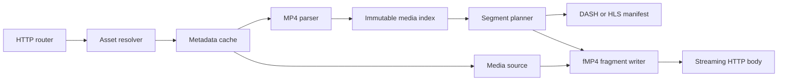

# TDD 0001: On-demand MP4 packaging core

- Status: Accepted
- Created: 2026-09-10
- Updated: 2026-09-10
- Related ADRs: [ADR 0001](../adr/0001-use-fragmented-mp4-for-media-segments.md)

## Implementation status

The first packaging core and the initial HLS HTTP vertical slice are implemented. The service loads a validated TOML asset catalog at startup, parses and plans each local MP4 once, caches initialization segments, and serves HLS playlists and fragmented MP4 media through Axum. Media fragments are currently assembled in bounded in-memory buffers; streaming source ranges directly into HTTP response bodies remains a performance follow-up before production use.

## Summary

Build an HTTP origin that reads existing MP4 files and packages their encoded samples on demand as MPEG-DASH and HLS. The first version will transmux compatible audio and video into fragmented MP4 segments; it will not decode or re-encode media.

The hot path should parse and cache source metadata once, calculate keyframe-aligned segment boundaries, generate small container headers, and stream sample byte ranges from the source. This makes work proportional to the requested segment instead of the duration of the asset.

## Terminology

- **Packaging or transmuxing:** changing manifests and containers without changing encoded audio or video.
- **Transcoding:** decoding and re-encoding media. This is CPU-intensive and outside the first core.
- **Progressive MP4:** a typical MP4 with movie metadata in `moov` and encoded samples in one or more `mdat` boxes.
- **Fragmented MP4:** an initialization segment plus media fragments containing `moof` metadata and `mdat` sample data.
- **CMAF:** a constrained fragmented MP4 media format intended to improve interoperability across streaming protocols.
- **GOP:** a group of pictures beginning with a random-access video sample, commonly called a keyframe.

## Goals

- Package local progressive MP4 files into on-demand DASH and HLS outputs.
- Share one fragmented MP4 segmenter between DASH and HLS.
- Avoid decoding, encoding, and whole-file copies on the request path.
- Align video segment starts to random-access samples.
- Preserve decode timestamps, presentation timestamps, and composition offsets.
- Bound memory, metadata size, sample count, and source reads for untrusted files.
- Cache immutable metadata and produce deterministic, CDN-cacheable responses.
- Keep protocol manifest generation separate from ISO Base Media File Format logic.
- Establish correctness and performance tests before adding a public configuration surface.

## Non-goals for the first core

- Transcoding or changing codecs, resolution, bitrate, frame rate, or GOP layout.
- Creating an adaptive bitrate ladder from one source file.
- DRM, HLS encryption, subtitles, ad insertion, clipping, or concatenation.
- Remote HTTP source files. The source abstraction should allow them later, but local files come first.
- Live ingest and LL-HLS playlist state.
- MPEG-TS output. Initial HLS uses fragmented MP4.
- Final TOML or YAML configuration design.

## Input contract

The first implementation accepts a seekable local MP4 with one supported video track and, optionally, one supported audio track. Initial codec support should be deliberately narrow:

- H.264/AVC video with its decoder configuration present in the sample entry.
- AAC-LC audio with its decoder configuration present in the sample entry.

Packaging cannot repair incompatible media. Input must already have suitable codecs and random-access points. Separate files used as an adaptive set must have aligned content, compatible durations, and matching GOP boundaries; that validation belongs after single-file packaging works.

Files with unsupported edit lists, malformed timing tables, external data references, encryption, or unsupported sample descriptions must fail with a precise error rather than produce questionable output.

## How an MP4 becomes streamable

A progressive MP4 usually stores global and track metadata in `moov`. Per-track sample tables describe where encoded samples are located and when they decode and display. Important data includes:

- movie and track timescales and durations;
- track type and codec configuration;
- decoding-time deltas from `stts`;
- composition offsets from `ctts`;
- random-access samples from `stss`;
- sample sizes from `stsz` or `stz2`;
- sample-to-chunk mapping from `stsc`;
- chunk offsets from `stco` or `co64`.

The parser expands or provides indexed access to these tables and creates an immutable `MediaIndex`:

```text
MediaIndex
  source identity and length
  movie timescale and duration
  tracks[]
    id, kind, timescale, duration
    codec and decoder configuration
    samples[]
      byte offset and size
      decode timestamp and duration
      composition offset
      random-access flag
```

The index contains metadata, not sample payloads. It is safe to share between requests after construction.

## Core component boundaries



### Media source

Expose the minimum random-access operations needed by the parser and writer:

```text
length() -> bytes
read_range(offset, length) -> bytes or stream
identity() -> stable cache key
```

The local implementation should use positioned reads so concurrent requests do not share a mutable seek cursor. A later HTTP implementation can satisfy the same contract with range requests.

### MP4 parser

Parse box headers defensively, validate every offset and size against the source length, and extract only metadata needed for packaging. Unknown boxes should normally be skipped by declared size. Nesting depth, box size, track count, sample count, and total metadata allocation require configured limits.

The parser should initially be backed by an established Rust ISO BMFF crate if a prototype proves that it exposes exact sample offsets and timing without copying payload data. We should compare candidate crates with a small fixture corpus before adopting one. Writing a complete parser is not an initial goal.

### Segment planner

Given a target duration, the planner creates a deterministic timeline:

1. Choose each video boundary at a random-access sample near the target duration.
2. Never begin a video segment on a dependent frame.
3. Select audio samples whose decode-time interval corresponds to the video interval.
4. Preserve exact per-track timescales; use checked integer rescaling only at boundaries.
5. Record actual durations for manifests rather than assuming every segment has the target duration.

The target duration is a policy, not a guarantee. Keyframe placement determines valid video boundaries. For adaptive bitrate output, all representations must use a shared boundary timeline.

### Fragment writer

The writer emits:

- an initialization segment containing `ftyp` and a fragment-ready `moov` with track metadata and `mvex`/`trex` defaults;
- one media segment per request, containing an optional `styp`, a generated `moof`, and an `mdat` containing selected encoded samples.

The `moof` carries sequence, track, base decode time, sample duration, size, flags, and composition offset information through `mfhd`, `traf`, `tfhd`, `tfdt`, and `trun` boxes. All arithmetic must be checked, and generated offsets must account for the final serialized header sizes.

For high performance, generate the small box headers into bounded buffers and stream payload ranges directly from the source. Group adjacent samples into contiguous reads. Do not collect an entire segment in one `Vec<u8>` unless a measured small-segment threshold justifies it. The HTTP layer should apply backpressure instead of reading faster than the client can receive.

### Protocol adapters

HLS and DASH should consume the same `MediaIndex` and `SegmentPlan`.

The initial HLS adapter produces:

- a master playlist;
- a VOD media playlist with exact `EXTINF` values;
- `EXT-X-MAP` pointing to the initialization segment;
- fragmented MP4 media segment URLs;
- `EXT-X-ENDLIST` for complete assets.

The initial DASH adapter produces a static MPD with an initialization URL and media URLs. `SegmentTemplate` with `SegmentTimeline` is the safest first representation because real segment durations vary with keyframe placement.

Manifest generation must escape untrusted values and must not expose filesystem paths.

## Request model

The exact public URL design remains open, but the internal request types should distinguish these operations:

```text
asset metadata
HLS master playlist
HLS media playlist
DASH MPD
track initialization segment
track media segment by number
```

A segment request follows this path:

1. Resolve an opaque asset identifier to an allowed local source.
2. Look up metadata by stable source identity.
3. On a miss, parse once and coalesce concurrent requests for the same source.
4. Resolve the requested track and segment number through the segment plan.
5. Generate the fragment header and stream only the selected source ranges.

## Caching

Use separate caches because their values and invalidation behavior differ:

- **Metadata cache:** parsed `MediaIndex` and segment plan, keyed by canonical asset identity plus file size and modification identity.
- **Manifest/init cache:** small generated responses, keyed by asset version and packaging settings.
- **Media segments:** deterministic and cacheable by an external reverse proxy or CDN. An in-process segment cache should be added only after measurements justify its memory cost.

Cache misses for the same asset should be coalesced to prevent repeated parsing under burst traffic. Never keep stale metadata after the source identity changes.

## Concurrency and performance

The intended hot path performs no codec work. Its main costs are metadata lookup, small header generation, source reads, and network writes.

- Use asynchronous HTTP and bounded streaming bodies for many concurrent clients.
- Keep blocking filesystem work away from asynchronous executor threads.
- Share immutable indexes with reference-counted ownership.
- Avoid a task per sample; process samples in contiguous byte-range groups.
- Put explicit limits on concurrent metadata parses and open sources.
- Place a caching proxy or CDN in front of the origin at scale.
- Measure before adopting Linux-specific I/O such as `io_uring` or `sendfile`; generated headers plus multiple source ranges may make vectored streaming simpler.

Initial performance metrics:

- metadata parse duration and bytes read;
- metadata cache hit rate and coalesced waiters;
- manifest and fragment generation duration;
- source bytes read versus response bytes written;
- active streams, backpressure time, and aborted responses;
- errors by parsing, planning, source I/O, and protocol category.

### Structured logging

Service logs use `tracing` fields rather than interpolated prose. The configured output format is either newline-delimited JSON for production collectors or compact text for local development. The configured level is one of `trace`, `debug`, `info`, `warn`, or `error`.

Logging must not apply stdout backpressure to media requests. A dedicated `tracing-appender` worker writes log records from a bounded, lossy queue. When the queue is full, records are dropped instead of blocking request tasks. The worker guard remains alive for the service lifetime so queued records are flushed during orderly shutdown.

The level policy limits hot-path cost:

- `info`: process lifecycle and one event per asset loaded at startup;
- `debug`: HTTP request completion and one event per generated media segment;
- `warn`: rejected client requests such as unknown assets or segments;
- `error`: internal request failures and shutdown-listener failures;
- `trace`: reserved for temporary diagnostics and never used per media sample.

No event logs media payloads, sample arrays, authentication values, or filesystem paths at `info`. Disabled `debug` events are filtered before formatting, and there is no event per MP4 sample.

## LL-HLS boundary

LL-HLS is not merely shorter VOD segments. It adds partial segments, rapidly changing playlists, blocking playlist reload, preload hints, rendition reports, and strict availability timing. These features require a stateful live or progressively growing source pipeline.

For an already complete MP4, serving small fMP4 parts is possible but does not reduce source-to-viewer latency because the entire source already exists. The first core should produce CMAF-compatible fragments and clean streaming boundaries so LL-HLS can reuse the fragment writer later. Live ingest, part publication, playlist state, and blocking reload belong in a separate technical design.

## How nginx-vod-module works

Kaltura's nginx-vod-module is an NGINX module written primarily in C. NGINX supplies the HTTP server, event loop, request routing, file and upstream I/O, buffer chains, and response filters. The module supplies its own media pipeline:

1. Resolve a local path, remote HTTP source, or mapped media-set description.
2. Read and parse MP4 metadata, including sample tables and codec configuration.
3. Cache metadata so segment requests do not repeatedly parse the source.
4. Select tracks and calculate segment boundaries, optionally aligning them to keyframes.
5. Generate HLS, DASH, MSS, or HDS manifests with protocol-specific code.
6. Generate segment container headers with its own HLS, DASH, MP4, and MPEG-TS writers.
7. Read the selected encoded frames and send them through NGINX buffer chains.

The normal MP4-to-HLS or MP4-to-DASH path is a repackaging path. It does not invoke an `ffmpeg` command and does not require FFmpeg libraries. The module parses MP4 and writes output containers itself, preserving encoded samples when no filter requires decoding.

FFmpeg is an optional build dependency for features that need codec processing:

- thumbnail decoding uses `libavcodec`, with resizing through `libswscale`;
- volume-map generation decodes audio with `libavcodec`;
- playback-rate, gain, and mixing filters use FFmpeg libraries such as `libavcodec` and `libavfilter`;
- some audio filtering configurations also require an encoder such as `libfdk_aac`.

OpenSSL, rather than FFmpeg, supplies optional encryption and decryption support. The relevant lesson for this service is to keep packaging independent from decoding. FFmpeg will be a development-time oracle and validator in iteration one, not a runtime packaging dependency.

## Configuration boundary

Iteration one uses TOML only. It is native to the Rust ecosystem, has an unambiguous data model for this configuration, and avoids maintaining duplicate TOML and YAML parsing, diagnostics, examples, and tests. YAML can be proposed later if an operational requirement justifies it.

The configuration loader deserializes TOML into typed settings and validates them before the server binds its listener. Iteration one reads configuration only at startup; hot reload is not supported. Settings include the listen address, one canonical media root, an explicit asset map, segment target duration, cache limits, parser limits, enabled protocols, and public base URL.

## Security and resource limits

- Treat MP4 files and all box lengths, counts, offsets, and timestamps as untrusted.
- Use checked arithmetic for offsets, durations, and allocation sizes.
- Reject paths that escape configured media roots, including through symlinks.
- Resolve public asset IDs separately from filesystem paths.
- Cap box nesting, metadata bytes, tracks, samples per track, segment samples, response header size, and parse concurrency.
- Return stable client errors for unsupported media and internal errors for unexpected failures without leaking host paths.
- Add fuzz targets for box parsing and segment planning once those modules exist.

## Correctness and performance validation

The first vertical-slice milestone is one local H.264/AAC MP4 producing an init segment and one media segment. It is successful only when:

1. The source index matches trusted probe output for tracks, duration, sample count, keyframes, and timestamps.
2. The generated init plus media segment is accepted by FFmpeg or FFprobe without decode errors.
3. HLS and DASH validators accept generated manifests.
4. A browser player can seek across the packaged asset.
5. Segment requests read only metadata and requested payload ranges, not the whole source.
6. Repeated requests hit the metadata cache and produce byte-identical responses.

Test fixtures must cover `moov` before and after `mdat`, `stco` and `co64`, constant and variable frame timing, B-frames with composition offsets, multiple audio sample rates, malformed boxes, and truncated data.

Benchmarks should separately measure metadata parsing, segment planning, fragment-header generation, local file throughput, allocation count, and concurrent request behavior. Optimization decisions require profiles from release builds and representative MP4 files.

## Implementation stages

1. **Fixture and probe:** generate small synthetic H.264/AAC fixtures, commit their generation recipe, and record trusted metadata using FFprobe.
2. **Source and parser spike:** test `mp4` 0.14 against exact offsets, timing, malformed-input behavior, and allocation cost. Reject it if the acceptance criteria in the first-iteration decisions are not met.
3. **Media index:** define protocol-neutral track/sample metadata and validate it against fixtures.
4. **Segment planner:** implement checked, keyframe-aligned timelines with unit and property tests.
5. **Fragment writer:** generate one init segment and one media segment, then validate and decode them.
6. **Minimal HTTP vertical slice:** use Axum and Tokio to expose one mapped asset, one HLS playlist, and separate-track fMP4 segments with streaming responses.
7. **DASH adapter:** add a static MPD over the same segment plan and fragments.
8. **Caching and load tests:** coalesce metadata parsing, add limits and metrics, then profile concurrency.
9. **Configuration:** load and validate the typed TOML service and asset catalog at startup.
10. **Later designs:** adaptive bitrate sets, remote sources, encryption/DRM, and live/LL-HLS.

## First-iteration decisions

These choices answer the design's initial open questions. They define the first implementation, not promises that every dependency or limitation is permanent.

### MP4 parser and writer

Use the pure-Rust `mp4` crate version 0.14 for the parser spike. It exposes ISO BMFF boxes, track metadata, sample count, decode start time, duration, composition offset, sync status, codec configuration, and box-writing traits. This is a better first fit than pulling in a complete transcoding framework.

Do not use `Mp4Reader::read_sample` on the production segment hot path because it returns sample payload bytes. Build the immutable `MediaIndex` from public sample-table boxes and use our `MediaSource` for positioned payload reads. Implement the small set of fragment boxes required by the design locally when the crate's generic writer cannot stream the desired layout without buffering.

The spike accepts `mp4` only if all fixture offsets, DTS, PTS, durations, sync flags, and codec configuration match FFprobe; parsing stays within configured metadata limits; and the index can be built without reading all `mdat` payloads. If it fails any criterion, use Mozilla's pure-Rust `mp4parse` for parsing and keep our own fragment writer. This fallback is explicit so the spike cannot stall the project.

### Segment layout

Use one track per initialization segment and media segment from the first release. Video and audio have separate URLs, `moof`/`mdat` pairs, and timelines. HLS references audio through `EXT-X-MEDIA`; DASH uses separate video and audio Adaptation Sets.

Separate tracks match common CMAF packaging, simplify `trun` data offsets and timing, avoid audio/video interleaving, and prepare for alternate audio and adaptive video. Muxed audio/video fragments and MPEG-TS are deferred compatibility features.

### Initial media profile

Support clear, static VOD with one H.264/AVC `avc1` video track and optional AAC-LC `mp4a.40.2` audio. Require codec configuration in the sample entry, one sample description per selected track, non-encrypted samples, and video segment starts on sync samples. Preserve B-frame composition offsets. Reject edit lists that alter presentation timing in iteration one.

Generate fragmented MP4 intended to be CMAF-compatible, HLS VOD playlists using `EXT-X-MAP`, and static DASH MPDs using `SegmentTemplate` plus `SegmentTimeline`. Do not claim formal CMAF conformance until the conformance suite passes. HEVC, AV1, Dolby codecs, encryption, subtitles, and multiple renditions are outside iteration one.

### HTTP and I/O stack

Use Axum 0.8 on Tokio 1, with Hyper and Tower through Axum. Axum provides typed routing and responses, Tokio provides scheduling and bounded blocking work, and Tower provides timeouts, tracing, limits, and other middleware without a custom server framework.

The first supported production platform is Linux. Local payload reads use positioned file I/O so requests never share a mutable seek cursor. Blocking opens, metadata parsing, and positioned reads run through a bounded blocking pool. The response body yields a generated header followed by bounded source chunks; yielding is driven by HTTP body polling so downstream backpressure limits reads. Dropping the request future cancels subsequent reads.

Do not adopt `io_uring`, memory mapping, or `sendfile` in iteration one. Generated headers plus disjoint source ranges reduce the benefit of a single-file send path. Profile the bounded positioned-read implementation before selecting a Linux-specific optimization.

### Asset mapping

Use an opaque, URL-safe asset ID in routes and an explicit TOML catalog that maps each ID to a path relative to one configured media root. A representative configuration is:

```toml
[storage]
media_root = "/srv/vod"

[assets.big-buck-bunny]
path = "movies/big-buck-bunny.mp4"
```

The route contains `big-buck-bunny`, never a filesystem path. On startup, validate asset IDs, reject absolute asset paths, canonicalize the media root and each existing source, and require every resolved source to remain beneath the root. Keep this behind an `AssetResolver` interface so a database or remote mapping service can replace the TOML catalog later.

### Source identity and mutation

Iteration one treats source media as immutable and requires publishers to replace files atomically rather than modifying them in place. There is no portable filesystem metadata tuple that detects every possible in-place mutation.

For local Linux files, identify an opened source by canonical path, device, inode, byte length, nanosecond modification time, and a hash of the parsed `moov` bytes. Build and serve the index from an open file handle, compare metadata before and after parsing, and discard the result if it changed. A replacement file receives a new identity and cache entry; existing requests may finish on the old open inode. In-place changes that deliberately preserve all identity fields are unsupported operator error.

### Validation tools and fixtures

Use these validation layers:

- Rust unit and property tests for box arithmetic, timing rescaling, sample-table expansion, and segment boundaries.
- Synthetic fixtures generated from FFmpeg test video and sine-wave sources, with the generation command committed alongside expected FFprobe JSON. This avoids third-party media licensing.
- `ffprobe` comparisons for source indexes and generated fragments, followed by `ffmpeg -v error` decode checks over complete generated HLS and DASH presentations.
- Playwright smoke tests with hls.js and dash.js in Chromium for startup, duration, seeking, and playback without fatal player errors.
- Apple's Media Streaming Validator on a macOS release job when macOS CI is introduced.
- The maintained DASH-IF Conformance tooling in a scheduled or release job rather than every fast pull-request job.

FFmpeg is an external test and fixture tool, not linked into or invoked by the production service. hls.js uses Apache-2.0 and dash.js uses BSD licensing; tests should pin their versions. Generated fixtures remain project-owned test artifacts, and every third-party fixture added later must record its source and redistribution license.

## References

- [Kaltura nginx-vod-module](https://github.com/kaltura/nginx-vod-module)
- [Apple HTTP Live Streaming documentation](https://developer.apple.com/streaming/)
- [RFC 8216: HTTP Live Streaming](https://www.rfc-editor.org/rfc/rfc8216)
- [DASH Industry Forum guidelines](https://dashif.org/guidelines/)
- ISO/IEC 14496-12, ISO Base Media File Format
- ISO/IEC 23000-19, Common Media Application Format
- ISO/IEC 23009-1, Dynamic Adaptive Streaming over HTTP
