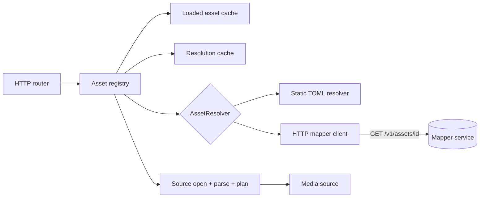

# TDD 0002: Asset mapper interface

- Status: Accepted; implemented
- Created: 2026-09-19
- Updated: 2026-09-20
- Related ADRs: None yet. Required before implementation: async media source, outbound HTTP client (see [Decisions](#decisions))
- Related designs: [TDD 0001](0001-on-demand-mp4-packaging-core.md), [TDD 0003](0003-production-grade-http-api.md) (the hardened HTTP layer this design builds on)

## Summary

Let `vod-module-rs` resolve an asset ID to a media location by asking an external **mapper service**, instead of reading a fixed TOML catalog at startup. When a client requests an asset the server has not loaded, it queries the mapper with the asset ID, receives a location descriptor, opens that location as a media source, parses and plans it, and serves it through the existing HLS and DASH routes.

This document defines:

1. the Rust-side `AssetResolver` interface that replaces the hard-wired TOML catalog;
2. the HTTP/JSON wire specification a mapper service must implement;
3. the lazy-loading, caching, and failure behavior that follows from resolving assets at request time;
4. the configuration, security, observability, and rollout plan.

The existing TOML catalog stays as the `static` resolver, so current deployments keep working unchanged.

## Implementation status

Everything in the rollout is implemented and tested: the async media source, the registry, the static and mapper resolvers, `file` and `http` locations, and the SSRF controls. The mapper contract is also published as a standalone reference for mapper authors in [Mapper API reference](../mapper-api.md); how the code works is in [Registry and resolvers](../internals/registry-and-resolvers.md).

Places where the implementation differs from the first draft of this document:

| Draft | Implemented |
| --- | --- |
| Registry knobs (`max_cached_resolutions`, `max_loaded_bytes`, `max_concurrent_loads`, `load_queue_timeout_ms`) inside `[resolver.http]` | They apply to both resolvers, so they live in a `[registry]` table. The byte budget is the existing `limits.max_index_bytes` and the concurrent-load bound is the existing `limits.max_startup_parses`, so there is one memory knob |
| `allowed_http_hosts`, `allow_insecure_http`, and remote timeouts in `[resolver.http]` | A separate `[remote_media]` table, because they govern media reads rather than mapper calls |
| Address filter: private ranges refused "unless the host is explicitly allow-listed" | Hosts must always be allow-listed, so that clause could never apply. The rule is now an explicit `remote_media.allow_private_addresses` switch, defaulting to off |
| `MediaSourceKind` with a `stream_range` method | Payload reads use `read_range` in chunks (`stream_chunk_bytes`), which the streaming task already does, so a separate streaming method was unnecessary |
| Parse over a "virtual reader" to be confirmed by a spike | Confirmed: `mp4::Mp4Reader::read_header` runs over `SparseFile`, which holds only box headers plus `ftyp` and `moov`. The spike passed, so the raw-box-walk fallback was not needed. The same path is now used for local files too, which removed a second read of `moov` |
| A changed `location` was not part of the cache key | A new location for the same version (a rotated signed URL) also drops the loaded copy, because the loaded asset keeps reading from the URL it was opened with |
| Startup preload was an open question | `registry.preload` (default on) loads the static catalog before serving so a bad file stops startup. It is a no-op for a mapper |
| Reachability probe was optional | Implemented as `resolver.http.readiness_probe_interval_ms`; zero disables it |
| A weak `ETag` | Refused as a validator, since `If-Range` requires a strong one. `Last-Modified` is the fallback |

## Context

Today the asset lifecycle is fixed at startup (TDD 0001, "Caching and asset lifecycle"; the HTTP layer around it is described in [TDD 0003](0003-production-grade-http-api.md)):

- [src/config/](../../src/config/) parses `[assets.<id>] path = "..."` into `BTreeMap<String, PathBuf>` and validates every path beneath `storage.media_root`.
- Before this design, `AppState::load` parsed every asset with a rayon pool before the listener bound, and a bad asset failed startup. (Now: `AppState::new` plus `preload`, see [Implementation status](#implementation-status).)
- `PackagedAsset` in [src/asset.rs](../../src/asset.rs) holds a concrete `LocalMediaSource`, the `MediaIndex`, the `SegmentPlan`, and init segments.
- `AppState.assets` is an immutable `HashMap`. An unknown ID is a `404`. There is no cache miss path, no request coalescing, and no reload.
- `SourceIdentity` in [src/source/mod.rs](../../src/source/mod.rs) is filesystem-shaped (canonical path, device, inode, mtime).

TDD 0001 anticipated this change in two places: the "Asset mapping" decision says the TOML catalog should sit "behind an `AssetResolver` interface so a database or remote mapping service can replace the TOML catalog later", and the non-goals defer remote sources. Runtime cache invalidation is marked **Deferred**. This design takes on the resolver and the lazy lifecycle it requires. Remote byte sources are covered only to the extent the resolver must be able to name them (see [Media locations](#media-locations)).

## Goals

- Define one resolver interface the HTTP layer depends on, with the TOML catalog and the mapper client as interchangeable implementations.
- Specify a small, versioned, implementation-neutral HTTP/JSON contract so any service (a database-backed API, a CMS, an object-store index) can act as a mapper.
- Resolve assets lazily on first request, with bounded concurrency and request coalescing, and without blocking the Tokio executor.
- Bound memory, mapper load, and startup cost: loaded assets and cached resolutions are limits-controlled.
- Keep the mapper a *location* service: it never sees or returns media bytes, and `vod-module-rs` never trusts it to return safe locations without validation.
- Degrade predictably when the mapper is slow or down: serve already-loaded assets, return stable status codes for the rest.
- Preserve every existing public route, URL version scheme, ETag behavior, and limit.

## Non-goals

- Authoring, uploading, or managing assets. The mapper is read-only from this service's point of view.
- Returning manifests, segment plans, or media metadata from the mapper. `vod-module-rs` still derives everything from the media itself.
- Per-viewer authorization, signed playback URLs, DRM, or entitlement checks. The mapper answers "where is asset X", not "may viewer Y watch it". Viewer authorization belongs in a front proxy.
- Push-based invalidation (webhooks, message queues). Freshness is TTL and version based in this iteration.
- Multi-rendition or adaptive sets (one asset ID still maps to one MP4).
- Non-HTTP mapper transports such as gRPC. The `AssetResolver` interface leaves room for them.
- Backward compatibility with the pre-release internal APIs and public URLs. The project has not been released, so this design breaks them where that gives a simpler or faster result (see [Decisions](#decisions)).

## Design

### Component overview



The **asset registry** replaces `AppState.assets`. It owns two caches and is the only component that talks to the resolver:

- **Resolution cache:** `asset_id -> ResolvedAsset`, with expiry. Answers "where is it" without calling the mapper.
- **Loaded asset cache:** `LocationKey -> Arc<PackagedAsset>`. Answers "is it parsed" without reopening the source.

### Resolver interface

The resolver has one operation: turn an asset ID into a location. It performs no parsing and never opens media.

```rust
/// What the mapper (or TOML catalog) says about one asset.
pub(crate) struct ResolvedAsset {
    /// Echo of the requested ID; the registry rejects a mismatch.
    pub(crate) asset_id: String,
    /// Where the media lives.
    pub(crate) location: AssetLocation,
    /// Opaque change token, required. Equal versions mean the same media.
    pub(crate) version: String,
    /// Absolute time after which this answer must not be used without revalidating.
    pub(crate) valid_until: Instant,
}

pub(crate) enum AssetLocation {
    /// Path relative to `storage.media_root`.
    File { path: PathBuf },
    /// Absolute `https` (or allowed `http`) URL serving the MP4 with byte-range support.
    Http { url: Url },
}

pub(crate) enum ResolveError {
    /// The mapper definitively says the asset does not exist.
    NotFound,
    /// The mapper could not be reached, timed out, or returned 429/5xx.
    Unavailable(String),
    /// The mapper answered but the answer is invalid or forbidden by policy.
    Rejected(String),
}
```

Dispatch is an enum, not a trait object, because the operation is `async` and the crate targets Rust 1.85 without `async-trait`:

```rust
pub(crate) enum AssetResolver {
    Static(StaticResolver),   // TOML catalog, no I/O, always fresh
    Http(HttpResolver),       // mapper client
}

impl AssetResolver {
    pub(crate) async fn resolve(
        &self,
        asset_id: &str,
        known_version: Option<&str>,
    ) -> Result<Resolution, ResolveError>;   // async fn; no blocking I/O
}

pub(crate) enum Resolution {
    /// A new or changed answer.
    Resolved(ResolvedAsset),
    /// The mapper confirmed `known_version` is still current (HTTP 304).
    Unchanged { valid_until: Instant },
}
```

`known_version` lets the registry revalidate cheaply with `If-None-Match` instead of downloading an identical answer.

### Media locations

`AssetLocation` is the contract between mapper and server. Two kinds are defined:

| Kind | Meaning | Server handling |
| --- | --- | --- |
| `file` | A path relative to `storage.media_root` | Same canonicalize-and-contain check as the TOML catalog, then `LocalMediaSource::open` |
| `http` | A URL that serves the MP4 bytes and supports `Range` requests | `HttpMediaSource` (async range reads over a pooled HTTP client) |

Unknown location types are rejected, not skipped, so a mapper cannot silently downgrade an asset.

### Async media source

Performance is the priority, so the remote source is asynchronous rather than blocking reads wrapped in threads. [TDD 0003](0003-production-grade-http-api.md) already moved the segment *response path* to an async task that holds a job slot only during each read, but it still reads through the synchronous `MediaSource::read_range` on `spawn_blocking`. That is acceptable for local files, where the blocking hop is one positioned read. For a remote origin each read is a network round trip, so a parked blocking thread per in-flight read would not scale. The source itself therefore becomes asynchronous.

The source becomes an enum with async methods (native `async fn` is not dyn-compatible, and an enum avoids an `async-trait` dependency):

```rust
pub(crate) enum MediaSourceKind {
    Local(LocalMediaSource),   // positioned reads via spawn_blocking, one hop per chunk
    Http(HttpMediaSource),     // Range GET over a shared, pooled, HTTP/2-capable client
}

impl MediaSourceKind {
    pub(crate) fn identity(&self) -> &SourceIdentity;
    pub(crate) fn len(&self) -> u64;
    /// Small reads (box headers, `moov`): returns the bytes.
    pub(crate) async fn read_range(&self, range: ByteRange) -> Result<Bytes>;
    /// Payload reads: yields bounded chunks without buffering the whole range.
    pub(crate) fn stream_range(&self, range: ByteRange, chunk: usize)
        -> impl Stream<Item = Result<Bytes>> + Send;
}
```

Consequences for the pipeline:

- **Streaming.** `StreamJob` in [src/http/](../../src/http/) keeps its structure (header chunk, then coalesced ranges, each send bounded by the idle timeout) but calls `MediaSourceKind::read_range` directly instead of wrapping `PackagedAsset::read_range` in `spawn_blocking`. The local variant performs that `spawn_blocking` internally.
- **Concurrency gating.** The job slot still surrounds each source read. A separate `max_inflight_source_reads` limit bounds outbound requests to a remote origin.
- **Local reads.** Unchanged: `read_exact_at` on the blocking pool per chunk (about 256 KiB). `io_uring` remains a later, measured optimization.
- **Remote reads.** One shared client per process, keep-alive, HTTP/2 where offered, `Range: bytes=a-b`, response checked for `206`, matching `Content-Range`, and a stable validator (`ETag` or `Last-Modified`) sent as `If-Range` so a changed object fails the request instead of mixing bytes from two versions.
- **Parsing.** `mp4::parse` stays synchronous CPU work, run on the bounded blocking pool over in-memory bytes. The async side reads only the top-level box headers and the `moov` payload (already isolated in `find_moov`, bounded by `max_metadata_bytes`) and hands the bytes to the parser. The `mp4` crate needs a `Read + Seek` input, so the parser is given a virtual reader over the file layout in which only `ftyp`/`moov` are backed by fetched bytes and `mdat` is skipped rather than fetched. Whether `Mp4Reader::read_header` can be driven that way without touching `mdat` must be confirmed by a spike; if not, the fallback is the raw box walk already in [src/mp4/parser.rs](../../src/mp4/parser.rs), which validates `moov` before the crate is used.
- **Mutation checks.** `verify_unchanged` (inode, mtime) is a local-only concept. For `http` sources the equivalent is: the validator captured on the first range read must match on every later read, and the `moov` hash is still compared before and after the parse.

### Asset registry behavior

`registry.get(asset_id) -> Result<Arc<PackagedAsset>, RegistryError>`:

1. **Validate the ID** with the existing `validate_asset_id` rules before any lookup. An invalid ID is `404` and never reaches the mapper, so path-like or oversized input cannot be forwarded.
2. **Check the resolution cache.** If a fresh entry exists, go to step 5.
3. **Resolve, coalesced.** At most one in-flight resolve per asset ID; concurrent requests await the same result. If a stale entry exists, send its `version` as `If-None-Match`. The shared resolve runs as its own task, so one waiting request being cancelled never cancels it for the others.
4. **Store the answer.** `Unchanged` extends the existing entry's `valid_until`. `Resolved` replaces it. `NotFound` is cached as a negative entry for `negative_ttl_ms`.
5. **Find or load the packaged asset.** The loaded-asset key is `(asset_id, version)`; the location is not part of the key, because equal versions mean identical media. On a miss, load coalesced per key: open the source, read `moov` asynchronously, run `mp4::parse`, `segment::plan`, and build init segments on the bounded blocking pool, then insert into the loaded cache.
6. **Return `Arc<PackagedAsset>`.** In-flight requests keep their `Arc` even if the cache later evicts or replaces the entry, so a segment already streaming is never torn down.

A changed `version` yields a new loaded-cache key and there is no grace period for the previous one (see [Decisions](#decisions)). The old `PackagedAsset` stays valid for requests already holding it and is dropped when they finish.

CPU-bound work (parse, plan) runs on a dedicated bounded pool gated by `max_concurrent_loads` (the existing `max_startup_parses`, renamed). No parse runs on a Tokio worker. I/O during a load is async.

#### Memory budget

A parsed asset is dominated by `Vec<Sample>`: about 40 bytes per sample, so a track at the `max_samples_per_track` limit (2,000,000) is roughly 80 MB. An entry-count bound such as `max_loaded_assets` alone cannot bound memory. The loaded cache is therefore weighted: each entry's weight is its estimated index bytes (samples times the sample size plus init segments), and the cache evicts least-recently-used entries above `max_loaded_bytes`. An asset larger than the whole budget is loaded, served, and not retained. `PackagedAsset::index_bytes` from [TDD 0003](0003-production-grade-http-api.md) already computes this weight, including the playlists rendered at load, and the static catalog uses it for its startup budget (`limits.max_index_bytes`).

#### Immutable URLs across version changes

Init and media URLs are served `immutable` and already require the current `v` ([TDD 0003](0003-production-grade-http-api.md)). With runtime location changes that check is the safeguard against a CDN caching new media under an old URL: after a version change, old `v` values stop resolving.

### Mapper wire specification

The contract is versioned by URL prefix (`/v1`). Mapper implementations must ignore unknown request headers; `vod-module-rs` ignores unknown JSON response fields, so additive changes are non-breaking.

#### Resolve an asset

```text
GET {base_url}/v1/assets/{asset_id}
```

Request headers:

| Header | Required | Meaning |
| --- | --- | --- |
| `Accept: application/json` | Yes | |
| `Authorization: Bearer <token>` | If configured | Static token from configuration or an environment variable |
| `If-None-Match: "<version>"` | Optional | Sent on revalidation; the mapper may answer `304` |
| `X-Request-Id` | Yes | Correlation ID generated by `vod-module-rs`, also logged |
| `User-Agent: vod-module-rs/<version>` | Yes | |

`{asset_id}` is already validated to ASCII letters, digits, `-`, and `_` (1 to 128 bytes), so it needs no escaping.

**`200 OK`** with `Content-Type: application/json`:

```json
{
  "asset_id": "big-buck-bunny",
  "version": "2026-09-18T10:22:31Z#7",
  "ttl_seconds": 300,
  "location": {
    "type": "file",
    "path": "movies/big-buck-bunny.mp4"
  }
}
```

```json
{
  "asset_id": "big-buck-bunny",
  "version": "etag-9f2c",
  "ttl_seconds": 300,
  "expires_at": "2026-09-19T12:00:00Z",
  "location": {
    "type": "http",
    "url": "https://origin.example.net/movies/big-buck-bunny.mp4"
  }
}
```

| Field | Type | Required | Rules |
| --- | --- | --- | --- |
| `asset_id` | string | Yes | Must equal the requested ID exactly |
| `version` | string | Yes | Opaque, 1 to 256 printable ASCII bytes. Equal versions mean identical media; any change of media content must change it. Also returned as the `ETag` header (required on `200` so `If-None-Match` revalidation works) |
| `ttl_seconds` | integer | No | How long the answer may be reused. Clamped to `[min_ttl_ms, max_ttl_ms]`; defaults to `default_ttl_ms` when absent |
| `expires_at` | RFC 3339 timestamp | No | Hard deadline for the *location*, for example a pre-signed URL. The effective validity is the earlier of TTL and `expires_at`. Never extended by revalidation |
| `location.type` | `"file"` or `"http"` | Yes | Unknown values are rejected |
| `location.path` | string | For `file` | Relative, no `..`, no leading `/`, no NUL, at most 4096 bytes |
| `location.url` | string | For `http` | Absolute; scheme, host, and redirects are policy-checked (see [Security and limits](#security-and-limits)) |

The response body is limited to `max_response_bytes`. The mapper must not include credentials in `location.url` userinfo; such URLs are rejected. Pre-signed query parameters are permitted and redacted from logs.

**`304 Not Modified`:** the `version` sent in `If-None-Match` is still current. The body is empty. `Cache-Control: max-age=N` on a `200` or `304` is honored as `ttl_seconds` when the body field is absent.

#### Errors

Error responses use `Content-Type: application/json` where possible:

```json
{ "error": { "code": "asset_not_found", "message": "no asset with that ID" } }
```

| Mapper status | Meaning | `vod-module-rs` behavior |
| --- | --- | --- |
| `404` | Asset does not exist | `ResolveError::NotFound`; client gets `404`; negative-cached |
| `410` | Asset existed and was removed | Same as `404`; also evicts any loaded copy |
| `401`, `403` | This service is not authorized | `ResolveError::Rejected`; client gets `502`; logged at `error` (operator misconfiguration) |
| `429` | Mapper is shedding load | `Unavailable`; honors `Retry-After` for backoff; client gets `503` |
| `5xx`, timeout, connect error | Mapper unhealthy | `Unavailable`; retried within the deadline; client gets `503` |
| `2xx` invalid body, ID mismatch, policy violation | Malformed answer | `Rejected`; client gets `502`; never cached as valid |
| Any other `4xx` | Contract violation | `Rejected`; client gets `502` |

The `error.code` is informational for logs. Behavior is decided by HTTP status only, so mappers do not need to agree on codes.

#### Health (optional)

```text
GET {base_url}/v1/health   ->   200
```

Used only by the readiness probe. Mappers without it are supported by disabling the probe.

#### Out of scope for the wire contract

No listing, search, batch resolve, or write endpoints. A batch resolve is the obvious first extension if per-request latency proves a problem; it would be a new `/v1` path and would not change the single-asset endpoint.

### Failure behavior

Client-visible outcomes for a request whose asset is not already loaded and fresh:

| Situation | Client response |
| --- | --- |
| Invalid asset ID syntax | `404`; mapper not called |
| Mapper: not found or gone | `404` |
| Mapper: unavailable, no usable cached answer | `503` with `Retry-After` |
| Mapper: unauthorized, malformed, or policy-rejected answer | `502` with a generic body |
| Location kind not supported by this build | `502` with a generic body |
| Source cannot be opened or parsed (unsupported media, missing file) | Same classification as TDD 0001 media errors; internal detail only in logs |
| Load queue wait exceeds `load_queue_timeout_ms` | `503` |
| Overall request deadline exceeded | `408` (existing timeout layer) |

**Stale-if-error:** if revalidation fails with `Unavailable` and a previously good answer exists, the registry may keep serving it for up to `stale_if_error_ms` past `valid_until` and logs each such use. A `404` or `410` always wins over stale data. An `expires_at` location deadline is never served stale.

Error bodies never contain mapper URLs, resolved locations, filesystem paths, or tokens, consistent with the existing error-disclosure rule.

### Configuration

The current layout keeps working: a config with `[assets.*]` and no `[resolver]` is a static resolver. The two forms are mutually exclusive, and `deny_unknown_fields` still applies.

```toml
[storage]
media_root = "/srv/vod"        # still required when locations may be `file`

[resolver]
type = "http"

[resolver.http]
base_url = "https://mapper.internal.example.net"
bearer_token_env = "VOD_MAPPER_TOKEN"   # env var name; the token itself is never in the file
connect_timeout_ms = 500
request_timeout_ms = 2000
max_retries = 2                          # idempotent GET only, jittered backoff, within request_timeout_ms
max_response_bytes = 16384
default_ttl_ms = 300000
min_ttl_ms = 5000
max_ttl_ms = 3600000
negative_ttl_ms = 5000
stale_if_error_ms = 60000
max_cached_resolutions = 10000
max_loaded_bytes = 2147483648                 # weighted budget, see Memory budget
max_concurrent_loads = 4
max_inflight_source_reads = 64                # outbound range requests to remote origins
load_queue_timeout_ms = 5000
allowed_http_hosts = ["origin.example.net"]   # empty means `http` locations are rejected
allow_insecure_http = false                   # permit http:// (not https://) locations
```

Validation at startup: `base_url` must be `https` unless `allow_insecure_mapper = true` (development); every numeric limit must be greater than zero; `min_ttl_ms <= default_ttl_ms <= max_ttl_ms`; the token variable must be set if named. The bearer token is never logged.

The `LimitsConfig.max_assets` limit keeps its meaning for the static resolver. `max_loaded_bytes` bounds the lazy cache: on overflow the least recently used entries are dropped from the cache (in-flight requests keep their `Arc`).

### Interface changes to existing code

| Area | Change |
| --- | --- |
| `Config` | `assets: BTreeMap<..>` becomes part of `ResolverConfig::Static`; add `ResolverConfig::Http` |
| `AppState` | Replace `assets: Arc<HashMap<..>>` with `Arc<AssetRegistry>`; `asset()` becomes `async` |
| `MediaSource` trait | Removed; replaced by the `MediaSourceKind` enum with async reads |
| `PackagedAsset::load` | `async`; takes an opened `MediaSourceKind` instead of a path |
| `fmp4::write_media_segment` | Async or test-only; the serving path uses the streaming pipeline |
| `SourceIdentity` | Not filesystem-only: an enum with `Local {..}` and `Remote { url_without_query, length, etag, last_modified }` variants |
| `Error` | Add resolver variants; map to the status table above |
| HTTP handlers | `state.asset(&id)?` becomes `state.asset(&id).await?`; no route or response change |

## Security and limits

- **The mapper is a trust boundary.** Everything it returns is validated before use. Validation failures are `Rejected`, never partially honored.
- **Path containment.** `file` locations receive the same treatment as TOML paths: reject absolute paths, `..`, and NUL, canonicalize beneath `storage.media_root`, require a regular file, and re-check after canonicalization so symlinks cannot escape.
- **SSRF for `http` locations.** A mapper-supplied URL makes the server issue requests, so it is allow-listed:
  - scheme `https` by default; `http` only with `allow_insecure_http = true`;
  - host must match `allowed_http_hosts` (exact match, no wildcards in the first version);
  - resolved IP addresses must not be loopback, link-local, private, or multicast unless the host is explicitly allow-listed; the check applies to the connected address, not just the name, to defeat DNS rebinding;
  - redirects are not followed by default;
  - userinfo in the URL is rejected.
- **Mapper transport.** `https` required by default; the bearer token is read from an environment variable, redacted from logs, and sent only to `base_url`'s origin. A mapper compromise can redirect assets to other allow-listed locations, but cannot make the server read paths outside `media_root` or contact hosts outside the allow-list.
- **Resource limits, all checked before allocation:** response size, resolution cache entries, loaded assets, concurrent loads, load queue wait, per-request mapper deadline, retry count, and TTL clamps. Existing parser limits (`max_source_bytes`, `max_metadata_bytes`, and so on) apply unchanged to every location kind.
- **Amplification.** Coalescing ensures N concurrent misses on one ID cost one mapper call and one load. Negative caching stops repeated probes for a missing ID from reaching the mapper on every request. Requests for IDs that fail syntax validation never reach it.
- **Cache poisoning.** A resolution is cached only after its `asset_id` matches the request and the whole answer validates. A media-parse failure discards the loaded entry and caches a short negative result, so a bad file cannot make every request re-parse it.
- **Information disclosure.** Client errors are generic. Locations, mapper URLs, and query strings (which may hold pre-signed credentials) are excluded from client responses and from `info`-level logs.

## Observability

Structured `tracing` events, following the existing level policy:

| Level | Event |
| --- | --- |
| `info` | `asset_loaded` (existing, now also emitted for lazy loads, with `resolver = static|http`), `resolver_ready` |
| `debug` | `asset_resolve_started`, `asset_resolved` (`elapsed_ms`, `cache = hit|miss|revalidated`), `asset_evicted` |
| `warn` | `asset_not_found`, `resolve_stale_served`, `resolve_retry` |
| `error` | `resolve_rejected`, `resolve_unauthorized`, `asset_load_failed` |

No event includes bearer tokens, full location URLs with query strings, or filesystem paths at `info`. Every mapper request carries an `X-Request-Id` that appears in both logs.

Metrics added to `/metrics`:

- `vod_resolver_requests_total{outcome="ok|not_found|unavailable|rejected|unchanged"}`
- `vod_resolver_request_duration_seconds` (histogram)
- `vod_resolution_cache_events_total{event="hit|miss|revalidate|stale|negative_hit"}`
- `vod_loaded_assets` (gauge) and `vod_asset_loads_total{outcome}`
- `vod_asset_load_duration_seconds` (histogram) and `vod_asset_load_queue_wait_seconds`
- `vod_resolver_coalesced_waiters_total`

Readiness: `/health` remains process liveness. A separate readiness signal reports mapper reachability from the most recent background probe when the HTTP resolver is enabled, so an orchestrator can choose to withhold traffic during a mapper outage without restarting the process.

## Testing

- **Unit:** location validation (path traversal, absolute paths, NUL bytes, oversized fields, unknown `type`); TTL clamping and `expires_at` precedence; response parsing with unknown fields, missing fields, and mismatched `asset_id`; SSRF checks for each rejected address class and scheme; status-to-`ResolveError` mapping for every row of the error table.
- **Registry (with a fake resolver):** single flight under N concurrent requests; coalesced result fan-out on failure; negative caching; stale-if-error window and its exclusion for `404`/`410` and `expires_at`; location change producing a new loaded-cache key while an old `Arc` keeps streaming; weighted LRU eviction at `max_loaded_bytes`; cancellation of a waiting request not cancelling the shared load.
- **Mapper client integration:** an in-process mock mapper on an ephemeral port covering `200`, `304`, `404`, `410`, `401`, `429` with `Retry-After`, `500`, slow response past the deadline, oversized body, invalid JSON, redirect responses, and connection reset.
- **Contract tests:** the JSON examples in this document are committed as fixtures and parsed by the client, so the spec and implementation cannot drift silently.
- **End to end:** existing HLS/DASH FFmpeg decode tests run once against the static resolver and once against a mock mapper returning `file` locations for the same fixtures, asserting byte-identical manifests and segments.
- **Regression:** the full existing suite passes unchanged with a TOML-only config.
- **Fuzzing:** add the mapper response parser and location validator as a fuzz target.
- **Performance:** measure added latency on a cold first request (mapper round trip plus parse), and confirm hit-path segment latency is unchanged against the TDD 0001 budgets, including no mapper call on a warm resolution cache.

## Rollout

All stages are done. The first items were delivered by [TDD 0003](0003-production-grade-http-api.md): the async streaming path with per-read job slots and idle timeouts, precomputed playlists, `v` enforcement, and the index memory budget. The stages below build on it.

1. **Async media source:** replace `MediaSource` with `MediaSourceKind` (local variant only), make `PackagedAsset::load` and the parser entry point async-aware, and keep every existing test green. This is a refactor with no behavior change.
2. **Registry and static resolver:** introduce `AssetRegistry`, `AssetResolver::Static`, the async `state.asset()` path, the weighted loaded cache, and single-flight loading, with an optional `lazy = true` for the static resolver to exercise lazy loading.
3. **Mapper client, `file` locations:** implement `HttpResolver`, the wire contract, TTL/negative/stale handling, configuration, and the mock-mapper test suite. Publish the specification as a standalone reference document for mapper authors, generated from the fixtures.
4. **`http` locations:** `HttpMediaSource`, the parse spike over `moov`-only bytes, `SourceIdentity` generalization, and the SSRF controls. Until it ships, `http` locations are rejected with the `502` outcome.
5. **Later, only if measured need:** batch resolve, push invalidation, mapper high availability with multiple base URLs, mTLS.

Rollback before release is a revert. After release, removing `[resolver]` and restoring `[assets.*]` returns to the static resolver. The mapper contract is additive under `/v1`; a breaking change requires `/v2` and support for both during migration.

## Decisions

Recorded from review of the first draft.

| Question | Decision | Consequence |
| --- | --- | --- |
| Blocking or async media source | Async | `MediaSource` becomes `MediaSourceKind` (stage 1). ADR required |
| HTTP client dependency | Accepted | Candidate `reqwest` with `rustls`, default features off, or `hyper-util` directly. ADR must cover TLS backend, DNS/redirect control (SSRF), pool limits, and binary size |
| Is `version` mandatory | Yes | Simpler cache key `(asset_id, version)`; mappers must produce a version and an `ETag` |
| Grace period for old versions after a location change | None | Old-version URLs return `404` once superseded; players recover by refetching the playlist. Interpreted from "we can break it" |
| Compatibility of pre-release APIs and URLs | Not preserved | Free to change internal signatures; `v` enforcement shipped in TDD 0003 |

## Open questions

- **Token rotation.** A single static bearer token is read from the environment at startup. Rotation without a restart (re-reading a file) is not implemented.
- **Batch resolve.** The obvious first extension if per-request latency on cold assets matters; it would be a new `/v1` path.
- **Signed-URL lifetime for in-flight streams.** A stream already reading from a signed URL keeps using it after the answer is rotated. Streams that outlive the URL fail; giving the loaded source a swappable location would remove that limit.
