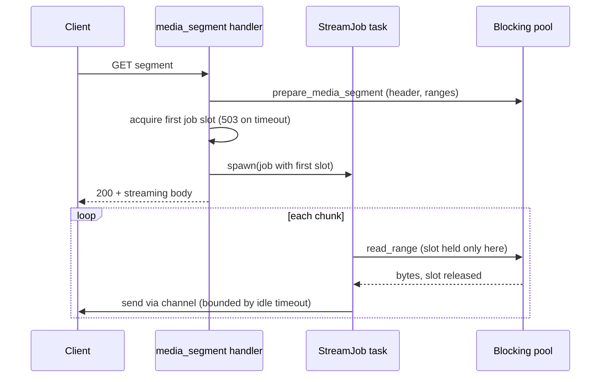
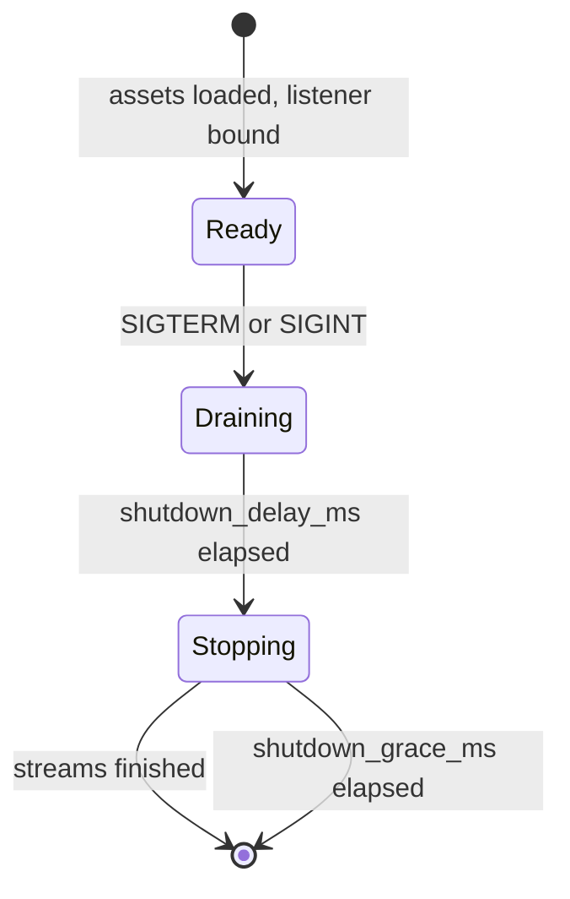

# TDD 0003: Production-grade HTTP API

- Status: Accepted
- Created: 2026-09-19
- Updated: 2026-09-19
- Related ADRs: None
- Related designs: [TDD 0001](0001-on-demand-mp4-packaging-core.md) (the packaging core this hardens), [TDD 0002](0002-asset-map-interface.md) (builds on this layer)

## Summary

A review of the first HTTP implementation found defects that would fail in production: slow clients could exhaust the segment job pool, immutable media URLs ignored their version, the HLS master playlist contained a literal `{version}`, shutdown ignored `SIGTERM`, CORS was fixed and incomplete, and there were no request metrics, request IDs, readiness signal, or global load protection. This design records those findings, the changes that fix them, and the operational contract that results.

All of it is implemented and covered by tests. The document is written as a design record rather than a plan: each section states the problem, the decision, and where it lives in the code. The project is unreleased, so several changes deliberately break earlier URLs and internal APIs.

## Context

The first implementation ([TDD 0001](0001-on-demand-mp4-packaging-core.md)) established correct packaging and streaming, with bounded backpressured range reads, strong ETags, and configurable limits. A read-through of [src/http/](../../src/http/), [src/protocol/](../../src/protocol/), and [src/asset.rs](../../src/asset.rs) against production expectations for an origin behind a CDN produced the findings below.

## Goals

- No small number of slow or stalled clients can take the origin out of service.
- Immutable URLs can never return different bytes.
- The service starts, drains, and stops correctly under a container orchestrator.
- Browser players work without operator guesswork about CORS, and operators can restrict or disable it.
- Operators can see request rate, errors, latency, load shedding, and stream failures, and can correlate a log line with a request.
- Per-request CPU and memory cost does not grow with asset size on the hot path.
- Errors are typed, and error responses cannot be cached as media.

## Non-goals

- TLS termination, viewer authentication, and per-client rate or connection limits. The origin sits behind a proxy or CDN for those (see [Remaining gaps](#remaining-gaps)).
- New media capabilities (codecs, encryption, subtitles, multiple renditions).
- A remote asset catalog. That is [TDD 0002](0002-asset-map-interface.md).
- Backward compatibility with pre-release URLs and internal APIs.

## Findings and decisions

| # | Finding | Severity | Decision |
| --- | --- | --- | --- |
| 1 | A response held a blocking thread and a job slot for its whole lifetime, including time spent waiting on a slow client. The timeout layer stops at response headers, so it did not cover the body. With at most 32 default job slots, 32 stalled clients blocked everyone. | High | [Async streaming with per-read slots and an idle timeout](#streaming-pipeline) |
| 2 | Init and media URLs are `immutable` for a year but the `v` query parameter was ignored, so a CDN could cache new bytes under an old URL. | High | [`v` is required and must match](#immutable-url-versioning) |
| 3 | The HLS master playlist wrote the literal text `{version}` into the audio playlist URI (`push_str` on a non-format string). The test only checked the `?v=` prefix. | High | Use `writeln!`; assert the real value |
| 4 | Only `SIGINT` was handled, so a container `SIGTERM` killed the process without draining. | High | [Graceful drain](#lifecycle-and-shutdown) |
| 5 | CORS allowed only `GET`/`HEAD` from any origin and exposed no headers, so `Content-Range` and `ETag` were unreadable to scripts and `Range`/`If-None-Match` preflights failed. CORS headers were also missing on 408 and 431. | High | [Configurable CORS](#cors) |
| 6 | Every master playlist and MPD request walked every sample of each track to estimate bandwidth (up to millions). | Medium | [Precompute at load](#load-time-precomputation) |
| 7 | HTTP status was derived by matching error message strings such as `"segment does not exist"`. | Medium | Typed `Error::NotFound` |
| 8 | `HEAD` on a media segment took a job slot and started the producer. | Medium | Answer from metadata only |
| 9 | `If-None-Match` matched only an exact single tag. No `If-Range`, no suffix ranges. | Medium | [Conditional and range handling](#conditional-and-range-requests) |
| 10 | Only one metric existed, and there was no request ID or readiness endpoint. | Medium | [Observability](#observability) |
| 11 | Each loaded asset keeps about 40 bytes per sample in memory with no total bound. | Medium | `limits.max_index_bytes` |
| 12 | Segment header construction (CPU proportional to sample count) ran on an async worker. | Medium | Run on the blocking pool |
| 13 | Audio segments were served as `video/mp4`; HLS `BANDWIDTH` was the average, not the peak; no release profile; no container image; no request cap. | Low | Correct content type, peak plus average bandwidth, `[profile.release]`, `Dockerfile`, `max_concurrent_requests` |
| 16 | The `mp4` crate's per-entry reads hit an unbuffered `File`, making a warm load of a 60-minute asset take about 2.4 s against a 250 ms budget. Found by the new benchmark harness. | High | Buffer the parser input (`BufReader`); the load now takes about 70 ms |
| 15 | `axum::serve` exposes no header-read timeout or connection limit, so a client dribbling headers or opening idle connections held a task and a descriptor indefinitely. | Medium | [In-process accept loop](#connection-control) |
| 14 | `stts`/`ctts` run-length entries were expanded without checking the running total against the (already limited) sample count, so one crafted entry could claim billions of samples. Found while documenting the parser. | High | Bound the running total before each expansion ([src/mp4/parser.rs](../../src/mp4/parser.rs)) |

## Design

### Streaming pipeline

`media_segment` prepares the segment header on the blocking pool (finding 12), then spawns an async `StreamJob` task and returns a body backed by a two-item channel.

Rules:

- **Slots follow reads, not responses.** A job slot (`limits.max_segment_jobs`) is held only while a source read is in flight and is released before waiting for the client. The first slot is acquired before response headers so overload can still return `503`; later reads acquire with the same queue timeout and end the stream with an error if it expires.
- **Every send is bounded.** Each channel send is wrapped in `limits.response_idle_timeout_ms`. A client that stops reading is dropped, which frees its task and buffered chunks.
- **Backpressure is preserved.** The channel holds two items, so a slow client stalls its own task, not a thread, and buffered memory stays near `2 x stream_chunk_bytes`.
- **HEAD does no source work.** Length and range come from prepared metadata, so `HEAD` neither takes a slot nor starts a task.
- **Abort reasons are counted** as `idle`, `client` (disconnect), or `error`.

A test stalls a client for longer than the idle timeout with a single job slot, then confirms a second client can complete and that the stalled stream was cut short and counted.

### Immutable URL versioning

Init and media handlers extract `?v=` and require it to equal `PackagedAsset::version()` (the first eight bytes of the source `moov` SHA-256, hex). A missing or different value returns `404` with `Cache-Control: no-store`. Playlists and manifests always emit the real version, so a conforming player never sees this error. Playlists are not `immutable` and carry only `max-age=60`, so they are not version-checked.

This is a breaking URL change and the reason a bare `/hls/x/video/init.mp4` no longer works.

### Conditional and range requests

- `If-None-Match` accepts a comma-separated list, weak tags (`W/"..."`, compared weakly), and `*`, across multiple header lines.
- `Range` supports a single `bytes=a-b`, `bytes=a-`, and the suffix form `bytes=-n`.
- `If-Range` that does not equal the current strong ETag causes the range to be ignored and the full `200` to be sent.
- Multi-range requests remain `416`, a deliberate limitation carried from TDD 0001.

### Load-time precomputation

`PackagedAsset::load` renders the HLS master, both HLS media playlists, and the DASH manifest once and stores them as `Bytes`. It also stores the version string. Request handlers clone a `Bytes` (a reference-count increment). Bandwidth is computed once per track from segment payload sizes: HLS declares the peak segment bitrate as `BANDWIDTH` and the mean as `AVERAGE-BANDWIDTH`; DASH `bandwidth` uses the peak.

`PackagedAsset::index_bytes` estimates resident memory (samples times `size_of::<Sample>()`, init segments, rendered playlists). `AppState::load` sums it over the catalog and fails startup above `limits.max_index_bytes`.

### CORS

CORS is a `[cors]` table validated at load and built into a `tower-http` layer at startup. The defaults suit a public origin behind a CDN; production deployments should list explicit origins.

| Key | Default | Notes |
| --- | --- | --- |
| `enabled` | `true` | Set `false` when a proxy or CDN owns CORS |
| `allowed_origins` | `["*"]` | Exact `scheme://host[:port]` values, or `["*"]`; cannot mix |
| `allowed_methods` | `["GET", "HEAD"]` | |
| `allowed_headers` | `range`, `if-none-match`, `if-range`, `x-request-id` | `["*"]` allowed |
| `exposed_headers` | `content-length`, `content-range`, `accept-ranges`, `etag`, `x-request-id` | `["*"]` allowed |
| `allow_credentials` | `false` | Rejected with any wildcard |
| `max_age_seconds` | `86400` | Preflight cache lifetime |

The CORS layer sits outside the timeout, header-limit, and load-shedding layers, so their error responses also carry CORS headers and remain readable by scripts. Shape validation runs in the `config` module, which stores plain strings; header-name and origin parsing runs in `http/cors.rs` when the layer is built in `AppState::load`, so an invalid value fails startup rather than a request. (The plain-string design originally kept the config free of HTTP crates for the fuzz target, which no longer compiles it by path.)

### Lifecycle and shutdown

- `/health` is liveness. `/ready` returns `200` until shutdown begins, then `503`.
- During `server.shutdown_delay_ms` the service keeps accepting connections so a load balancer can observe `/ready` and drain.
- After that, the accept loop stops accepting and waits for in-flight responses, bounded by `server.shutdown_grace_ms`, after which the process closes the remaining streams and exits.

### Load protection

`limits.max_concurrent_requests` (default 10,000) is enforced by middleware with a non-blocking `try_acquire`. At the limit the response is `503` with `Retry-After: 1` and the `vod_http_requests_shed_total` counter increments. `/health`, `/ready`, and `/metrics` bypass the limit so probes and scraping keep working under overload. The slot is held until response headers are produced; body streaming is bounded by the job slots and idle timeout described above.

### Connection control

`http/server.rs` runs hyper directly instead of `axum::serve`:

- **Connection cap.** A semaphore of `limits.max_connections`. When it is exhausted the accepted socket is dropped at once and `vod_http_connections_rejected_total` increments. The permit travels with the connection task, so it is released however the connection ends.
- **Header-read timeout.** `limits.header_read_timeout_ms` is applied to hyper's HTTP/1 header read, which restarts for each request on a keep-alive connection. It therefore stops a slow-header client and also closes an idle keep-alive connection that never sends another request.
- **Accept errors.** Per-connection errors (reset, aborted, refused) are skipped; anything else, typically descriptor exhaustion, is logged and followed by a one-second back-off.
- **Draining.** On shutdown the loop stops accepting and awaits hyper's graceful shutdown, which closes idle keep-alive connections and lets responses in flight finish. The grace timer in `serve` still bounds the wait.
- `TCP_NODELAY` is enabled on accepted sockets.

Tests drive real sockets: a stalled header block is closed, an idle keep-alive connection is closed, connections beyond the cap are refused and the server recovers when one closes, and shutdown does not wait for an idle connection.

### Errors

`Error::NotFound` maps to `404`; everything else unexpected maps to `500`, with a generic public message and detail only in logs. Every error a handler produces carries `Cache-Control: no-store`, and `503` adds `Retry-After: 1`. `503` responses log at `warn` (they are expected under load); other server errors log at `error`.

## Observability

Every response carries `X-Request-Id`. A caller-supplied value of 1 to 128 characters from letters, digits, `-`, `_`, `.` is preserved; anything else is replaced with a generated ID. The ID is attached to the request tracing span, so it appears on every log line for that request. The tracing span is at `info` level, so request IDs appear on `warn` and `error` lines even at the default log level.

Metrics are lock-free atomics indexed by route template and a fixed status list, so cardinality cannot grow with client input:

| Metric | Type |
| --- | --- |
| `vod_http_requests_total{route,status}` | counter |
| `vod_http_request_duration_seconds{route}` | histogram, time to response headers |
| `vod_http_requests_in_flight` | gauge, cancellation-safe |
| `vod_http_response_bytes_total`, `vod_source_read_bytes_total` | counters |
| `vod_http_requests_shed_total`, `vod_segment_queue_timeouts_total` | counters |
| `vod_segment_stream_aborts_{idle,client,error}_total` | counters |
| `vod_log_dropped_lines_total` | counter |

Per-route request counts and durations record the time to response headers. Body transfer time is not included; watch the abort counters and the byte counters for that.

## Security and limits

New or changed limits, all validated to be greater than zero:

| Limit | Default | Behavior at the limit |
| --- | ---: | --- |
| `limits.max_concurrent_requests` | 10,000 | `503` + `Retry-After` |
| `limits.response_idle_timeout_ms` | 30,000 | Stream dropped, `idle` abort counted |
| `limits.max_index_bytes` | 4 GiB | Startup fails with the measured size |
| `limits.max_connections` | 10,000 | New connections closed at accept |
| `limits.header_read_timeout_ms` | 10,000 | Connection closed |
| `server.shutdown_grace_ms` | 30,000 | Remaining streams closed |
| `server.shutdown_delay_ms` | 0 | Accept while `/ready` reports `503` |

Also: the parser rejects any `stts` or `ctts` entry that would push the expanded total past the `stsz` sample count, before allocating (finding 14). Error responses never include host paths or internal messages.

## Testing

The HTTP tests in `src/http/tests.rs` drive the real router through `tower::ServiceExt::oneshot` and cover: real version in playlists; missing and stale `v`; audio content type; `If-None-Match` lists, weak tags, and `*`; single, suffix, and unsatisfiable ranges; `If-Range` mismatch; `HEAD` succeeding with every job slot held; header-limit response with CORS headers; request-ID generation, echo, and replacement; concurrency shedding with probes exempt; `503` when no job slot frees; idle-client eviction freeing the slot; CORS defaults, preflight, restricted origins, disabled CORS, and invalid header names failing startup; the index memory budget; readiness flipping; metric counters; and the existing FFmpeg decode of HLS and DASH over a real socket. `config` tests cover CORS validation, and `mp4/parser.rs` has a regression test for finding 14.

A live smoke run of the release binary confirmed the response headers, the `v` check, metrics output, and a clean exit on `SIGTERM`.

## Rollout

Implemented in one change. Because the project is unreleased, no migration is provided: clients must use the versioned URLs the playlists emit, and any test tooling that fetched bare media URLs must add `?v=`. Operators should review `[cors]`, set a real `shutdown_delay_ms`, and size `max_index_bytes` against container memory ([operations guide](../operations.md)).

## Remaining gaps

- **Per-client connection limits and TLS.** The connection cap is global, not per address; per-client limits, TLS termination, and authentication remain the proxy's job.
- **Vendor validators and browser playback tests.** A structural conformance suite now exists ([conformance](../conformance.md)), but Apple's validator, the DASH-IF tool, and hls.js/dash.js browser tests have not been run. The load and latency budgets are measured by `make bench` ([benchmarks](../benchmarks.md)) on one laptop; the reference host is still to do.
- **Structure.** The oversized `http.rs` was split into `http/` and the crate gained a library target after this design; see [Code organization](../internals/code-organization.md).

## Open questions

- Should multi-range requests return `200` with the full body, as RFC 9110 permits, instead of `416`?
- Should the request-ID span also be attached to the segment streaming task so its `warn`/`error` lines carry the ID? Spawned tasks currently do not inherit the request span.
